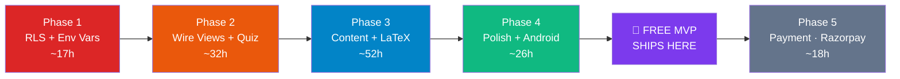

# 🚀 CBSE Core — Master MVP Launch TODO

> **Created**: 2026-06-23  
> **Status**: Active — single source of truth for MVP launch  
> **Critical Rule**: Payment (Razorpay) is **Phase 5 — the LAST phase**. The free MVP ships first. No payment code lands until the product is stable and students are actively using it.

---

## Executive Summary

| Metric | Value |
|--------|-------|
| **Total Tasks** | 62 |
| **Estimated Total Hours** | ~145 h |
| **Phases** | 5 (Foundation → Core → Content → Polish → Payment) |
| **Current State** | Auth ✅, Schema ✅, Seed (partial) ✅, CI/CD ✅, UI shell ✅ |
| **Critical Path** | RLS → Env Vars → Wire Views → Quiz Expansion → Content Seeding → Android Build → Domain → **Ship Free MVP** → Payment |
| **Hard Blockers** | Supabase RLS must be on before any student touches production. Env vars must be out of source before public repo/APK. |

### What "Done" Means for MVP
Students can: sign up → browse all CBSE subjects/chapters → read revision notes with LaTeX → take MCQ quizzes → see streaks & progress → use the Android app — **all for free**. Premium content is locked behind `is_free=false` on the client, but no real payment flow exists yet. Payment is added in Phase 5 only after we have real students.

---

## Phase 1: Foundation & Security 🔒
> **Goal**: Lock down data, remove hardcoded secrets, prevent any student data leak.  
> **Blocked by**: Nothing — start here.  
> **Blocks**: Everything else (no student traffic until RLS is on).

### 1.1 Row Level Security (RLS)

- [ ] **P0 | 1h** | Enable RLS on all 10 tables (`users`, `subscriptions`, `subjects`, `chapters`, `lessons`, `user_progress`, `user_streaks`, `daily_activity_logs`, `quizzes`, `quiz_questions`, `quiz_attempts`)
  - **Deps**: None
  - **Deliverable**: `db/rls_policies.sql` migration file applied to Supabase

- [ ] **P0 | 2h** | Create RLS policy: students read/update only their own `user_progress`
  - **Deps**: 1.1.1
  - **Deliverable**: Policy `Users can manage own progress` on `user_progress FOR ALL USING (auth.uid() = user_id)`

- [ ] **P0 | 1h** | Create RLS policy: students read/update only their own `user_streaks`
  - **Deps**: 1.1.1
  - **Deliverable**: Policy `Users can manage own streaks` on `user_streaks`

- [ ] **P0 | 1h** | Create RLS policy: students insert/read only their own `quiz_attempts`
  - **Deps**: 1.1.1
  - **Deliverable**: Policy on `quiz_attempts FOR ALL USING (auth.uid() = user_id)`

- [ ] **P0 | 1h** | Create RLS policy: students read/write only their own `daily_activity_logs`
  - **Deps**: 1.1.1
  - **Deliverable**: Policy on `daily_activity_logs`

- [ ] **P0 | 1h** | Create RLS policy: students read only their own profile in `users`
  - **Deps**: 1.1.1
  - **Deliverable**: Policy `Users can read own profile` on `users FOR SELECT`

- [ ] **P0 | 1h** | Create RLS policy: students read only their own `subscriptions`
  - **Deps**: 1.1.1
  - **Deliverable**: Policy on `subscriptions FOR SELECT USING (auth.uid() = user_id)`

- [ ] **P0 | 1h** | Create RLS policy: all authenticated users can read `subjects`, `chapters`
  - **Deps**: 1.1.1
  - **Deliverable**: Public-read policies for course catalog tables

- [ ] **P0 | 2h** | Create RLS policy: `lessons` — free lessons readable by all authenticated; paid lessons only by premium subscribers
  - **Deps**: 1.1.1, 1.1.7
  - **Deliverable**: Policy using `is_free = true OR EXISTS(SELECT 1 FROM subscriptions WHERE …)`

- [ ] **P0 | 1h** | Create RLS policy: `quiz_questions` — hide `correct_option_index` and `correct_answer_text` from direct PostgREST reads (use a DB view or column-level grant)
  - **Deps**: 1.1.1
  - **Deliverable**: Either a `quiz_questions_safe` view or column-level `REVOKE` so answer keys aren't leaked via the REST API

- [ ] **P0 | 2h** | Test all RLS policies: verify student A cannot read student B's progress, verify unauthenticated requests are blocked, verify paid lesson content is hidden from free users
  - **Deps**: 1.1.2 through 1.1.10
  - **Deliverable**: Passing test script (SQL or Supabase test client)

### 1.2 Environment Variables & Secrets

- [ ] **P0 | 1h** | Remove hardcoded Supabase URL and Anon Key default values from `config.dart` — make `String.fromEnvironment` mandatory (fail-fast if missing)
  - **Deps**: None
  - **Deliverable**: Updated `config.dart` with empty default → assert at startup

- [ ] **P0 | 1h** | Add `--dart-define=SUPABASE_URL=… --dart-define=SUPABASE_ANON_KEY=…` to GitHub Actions workflows (`firebase-hosting-merge.yml`, `firebase-hosting-pull-request.yml`)
  - **Deps**: 1.2.1
  - **Deliverable**: CI builds inject env vars from GitHub Secrets

- [ ] **P0 | 0.5h** | Add `SUPABASE_URL` and `SUPABASE_ANON_KEY` as GitHub repository secrets
  - **Deps**: None
  - **Deliverable**: Secrets configured in GitHub → Settings → Secrets

- [ ] **P1 | 0.5h** | Add `.env.example` to repo root documenting all required environment variables
  - **Deps**: None
  - **Deliverable**: `.env.example` file committed

---

## Phase 2: Core Features ⚡
> **Goal**: Wire all views to real Supabase data. Fix quiz bugs. Make progress tracking actually work. Client-side paywall for premium lessons.  
> **Blocked by**: Phase 1 (RLS must be on before real students use these features)  
> **Blocks**: Phase 3 (content won't be useful until views work), Phase 4 (can't launch a broken app)

### 2.1 Wire Views to Real Database

- [ ] **P0 | 3h** | `DashboardView`: wire "Avg Quiz Score" stat card to real `quiz_attempts` aggregate (currently static/placeholder)
  - **Deps**: Phase 1 complete
  - **Deliverable**: Dashboard shows actual `AVG(score_percentage)` from `quiz_attempts` for current user

- [ ] **P0 | 2h** | `DashboardView`: wire "Study Time" stat card to real `user_progress.watch_time_seconds` aggregate
  - **Deps**: Phase 1 complete
  - **Deliverable**: Dashboard shows total watch time computed from DB

- [ ] **P0 | 2h** | `DashboardView`: wire "Syllabus Coverage" stat to actual completed lessons / total lessons ratio
  - **Deps**: `fetchCompletedLessonIds()` already works
  - **Deliverable**: Accurate percentage on dashboard

- [ ] **P0 | 3h** | `ProgressView`: wire Board Readiness Index (radial gauge) to server-computed mastery data
  - **Deps**: Subject mastery computed from `user_progress`
  - **Deliverable**: `MasteryRadialGauge` shows real weighted average

- [ ] **P0 | 3h** | `ProgressView`: wire `WeeklyConsistencyChart` to real `daily_activity_logs` (last 7 days)
  - **Deps**: Phase 1 complete
  - **Deliverable**: Add `fetchWeeklyActivity()` to `DatabaseService`, chart reads real data

- [ ] **P1 | 2h** | `ProgressView`: wire topic-wise mastery bars to per-chapter completion percentages
  - **Deps**: 2.1.3
  - **Deliverable**: Each subject → chapter has an accurate mastery bar

### 2.2 Quiz Engine Fixes

- [ ] **P0 | 2h** | Fix quiz grading: verify `correct_option_index` from DB matches 0-indexed option selection in `QuizView` (currently options in seed have "A. …" prefix — need to strip or adjust indexing)
  - **Deps**: Seed data review
  - **Deliverable**: Correct answer always highlighted green on selection

- [ ] **P0 | 1h** | Show explanation/rationale after answering each question (add `explanation` field to `quiz_questions` table and display in UI)
  - **Deps**: Schema migration
  - **Deliverable**: `ALTER TABLE quiz_questions ADD COLUMN explanation TEXT;` + UI renders it post-answer

- [ ] **P1 | 2h** | Quiz attempt history: show past attempts on quiz selector card (best score, last attempted date)
  - **Deps**: `quiz_attempts` data
  - **Deliverable**: Quiz card shows "Best: 80% • Last: 2 days ago"

- [ ] **P1 | 1h** | Quiz timer: add optional countdown timer per quiz (configurable `time_limit_seconds` column)
  - **Deps**: Schema migration
  - **Deliverable**: Timer bar in active quiz UI

### 2.3 Progress & Streak Tracking

- [ ] **P0 | 2h** | Record `watch_time_seconds` incrementally for video lessons (currently hardcoded to `0`)
  - **Deps**: `LessonsView` animation controller provides elapsed seconds
  - **Deliverable**: `recordLessonCompletion()` called with real elapsed time

- [ ] **P0 | 1h** | Fix streak double-increment: if a student completes two lessons on the same day, streak should increment only once
  - **Deps**: Review `recordActivityAndIncrementStreak()` logic in `database_service.dart`
  - **Deliverable**: `last_activity_date == today` check prevents double-increment

- [ ] **P1 | 2h** | Streak freeze / grace period: allow one missed day without breaking streak (configurable)
  - **Deps**: 2.3.2
  - **Deliverable**: `streak_freeze_available BOOLEAN` column on `user_streaks`

### 2.4 Client-Side Paywall (Free MVP — No Real Payment)

- [ ] **P0 | 2h** | Enforce `is_free` check on lesson content: if `lesson.isFree == false` AND `!userState.isPremium`, show lock overlay and "Upgrade to Premium" CTA instead of content
  - **Deps**: `checkUserPremiumStatus()` already implemented
  - **Deliverable**: Locked lessons show 🔒 overlay in `LessonsView`

- [ ] **P1 | 1h** | Hide "Secure Checkout" and mock payment UI in `BillingView` for MVP — replace with "Coming Soon" or "Join Waitlist" card
  - **Deps**: None
  - **Deliverable**: BillingView shows pricing info + "Notify me when Premium launches" email capture

- [ ] **P1 | 1h** | Remove `createUserMockSubscription()` from production build (keep for development/testing only behind a debug flag)
  - **Deps**: None
  - **Deliverable**: Mock subscription gated behind `kDebugMode`

---

## Phase 3: Content 📚
> **Goal**: Populate the database with real NCERT content. Every chapter across all 3 subjects gets revision notes and MCQs. LaTeX renders correctly.  
> **Blocked by**: Phase 2 (quiz and notes views must work before content matters)  
> **Source material**: 49 pre-extracted chapter text files in `/home/sagarv/Projects/cbse_class10_textbooks/extracted_text/`

### 3.1 MCQ Generation from NCERT PDFs

- [ ] **P0 | 6h** | Generate MCQs for Mathematics (14 chapters × ~8 questions = ~112 questions) from `mathematics_*.txt` extracted texts
  - **Deps**: Extracted text files available ✅
  - **Deliverable**: SQL INSERT statements in `db/seed_math_quizzes.sql`

- [ ] **P0 | 6h** | Generate MCQs for Science (13 chapters × ~8 questions = ~104 questions) from `science_*.txt` extracted texts
  - **Deps**: Extracted text files available ✅
  - **Deliverable**: SQL INSERT statements in `db/seed_science_quizzes.sql`

- [ ] **P0 | 6h** | Generate MCQs for Social Science (22 chapters across History/Civics/Economics/Geography × ~6 questions = ~132 questions) from `social-*.txt` extracted texts
  - **Deps**: Extracted text files available ✅
  - **Deliverable**: SQL INSERT statements in `db/seed_social_quizzes.sql`

- [ ] **P0 | 2h** | Create missing `chapters` rows for all remaining chapters (currently only 5 seeded; need ~49 total)
  - **Deps**: None
  - **Deliverable**: Updated `db/seed.sql` or new `db/seed_chapters.sql` with all NCERT chapter entries

- [ ] **P0 | 1h** | Create missing `lessons` rows (at least 1 video + 1 note per chapter) for all ~49 chapters
  - **Deps**: 3.1.4
  - **Deliverable**: Lesson stubs in seed file (notes can be populated in 3.2; video lessons reference placeholder whiteboard types)

### 3.2 Revision Notes (Markdown + LaTeX)

- [ ] **P0 | 8h** | Write revision notes for remaining Mathematics chapters (12 chapters × markdown notes) — use extracted text as source, format with LaTeX `$...$` and `$$...$$`
  - **Deps**: 3.1.4, 3.1.5
  - **Deliverable**: `note_content` column populated for all Math note-type lessons

- [ ] **P0 | 8h** | Write revision notes for remaining Science chapters (11 chapters × markdown notes) — include chemical equations, diagrams described in text
  - **Deps**: 3.1.4, 3.1.5
  - **Deliverable**: `note_content` populated for all Science note-type lessons

- [ ] **P0 | 8h** | Write revision notes for remaining Social Science chapters (21 chapters × markdown notes) — include key dates, movements, map references
  - **Deps**: 3.1.4, 3.1.5
  - **Deliverable**: `note_content` populated for all Social Science note-type lessons

- [ ] **P0 | 1h** | Consolidate all seed files into a single runnable migration: `db/seed_full.sql`
  - **Deps**: 3.1.1–3.1.5, 3.2.1–3.2.3
  - **Deliverable**: One-command seed that populates all content

### 3.3 LaTeX Rendering in Flutter

- [ ] **P0 | 3h** | Integrate a LaTeX/math rendering package (e.g., `flutter_math_fork` or `katex_flutter`) into `LessonsView` notes panel
  - **Deps**: `pubspec.yaml` dependency add
  - **Deliverable**: Inline `$…$` and display `$$…$$` math renders correctly in revision notes

- [ ] **P0 | 2h** | Custom markdown renderer: extend the notes markdown parser to recognize and render LaTeX blocks, "Do You Know?" callouts, CAUTION tags, and Activity boxes using NCERT theme styling
  - **Deps**: 3.3.1
  - **Deliverable**: Notes match the NCERT textbook visual system (magenta bullets, orange callouts, Georgia serif)

- [ ] **P1 | 2h** | Test LaTeX rendering across all seeded notes — verify no broken formulas, correct Greek symbols, proper fractions
  - **Deps**: 3.3.1, 3.3.2
  - **Deliverable**: Visual QA pass on all note-type lessons

---

## Phase 4: Polish & Launch 🎯
> **Goal**: Production-quality UX, error handling, Android APK on Play Store, custom domain live.  
> **Blocked by**: Phase 2 + Phase 3 (features and content must be solid)

### 4.1 Custom Domain

- [ ] **P0 | 1h** | Register/confirm custom domain (e.g., `cbsecore.com` or `cbsecore.in`)
  - **Deps**: Domain registrar account
  - **Deliverable**: Domain registered and DNS accessible

- [ ] **P0 | 1h** | Connect custom domain to Firebase Hosting — add DNS records (A/CNAME), verify ownership, provision SSL
  - **Deps**: 4.1.1
  - **Deliverable**: `cbsecore.com` serves the Flutter Web build with HTTPS

### 4.2 Android Build (Google Play)

- [ ] **P0 | 1h** | Generate production keystore (`keytool -genkey …`) and store securely
  - **Deps**: None
  - **Deliverable**: `upload-keystore.jks` stored outside repo (in secure storage), key alias documented

- [ ] **P0 | 1h** | Configure `android/app/build.gradle` for release signing, minSdkVersion, applicationId (`com.cbsecore.app` or similar)
  - **Deps**: 4.2.1
  - **Deliverable**: `flutter build appbundle --release` produces signed AAB

- [ ] **P0 | 0.5h** | Build release APK/AAB: `flutter build appbundle --release --dart-define=SUPABASE_URL=… --dart-define=SUPABASE_ANON_KEY=…`
  - **Deps**: 4.2.2, 1.2.1
  - **Deliverable**: `build/app/outputs/bundle/release/app-release.aab`

- [ ] **P0 | 2h** | Set up Google Play Developer Console: create app listing, upload AAB, fill store listing (screenshots, description, content rating)
  - **Deps**: 4.2.3, Google Play Developer account ($25 one-time)
  - **Deliverable**: App submitted for review

- [ ] **P1 | 1h** | Add app icon (1024×1024) and splash screen matching NCERT theme
  - **Deps**: None
  - **Deliverable**: `flutter_launcher_icons` configured, splash screen with CBSE Core branding

### 4.3 UX Polish

- [ ] **P0 | 2h** | Loading states: add skeleton/shimmer loaders to DashboardView, LessonsView, QuizView while data fetches
  - **Deps**: None
  - **Deliverable**: No blank white screens during data fetch

- [ ] **P0 | 2h** | Empty states: add illustrated empty-state widgets when no quizzes attempted, no progress yet, no subjects loaded
  - **Deps**: None
  - **Deliverable**: Friendly "Start your first quiz!" messages instead of blank views

- [ ] **P0 | 1h** | Pull-to-refresh: add `RefreshIndicator` to DashboardView and LessonsView
  - **Deps**: None
  - **Deliverable**: Users can pull to reload data

- [ ] **P1 | 2h** | Smooth page transitions: add `Hero` animations for subject cards → lessons view, quiz cards → active quiz
  - **Deps**: None
  - **Deliverable**: Polished navigation transitions

- [ ] **P1 | 1h** | Responsive fixes: test all views at 360px (small Android), 768px (tablet), 1440px (desktop) — fix any overflow or truncation
  - **Deps**: None
  - **Deliverable**: No layout overflow warnings, text readable at all sizes

### 4.4 Error Handling & Resilience

- [ ] **P0 | 2h** | Global error boundary: wrap `MaterialApp` with an error handler that catches unhandled exceptions and shows a user-friendly error screen (not a red crash screen)
  - **Deps**: None
  - **Deliverable**: `FlutterError.onError` + `ErrorWidget.builder` configured

- [ ] **P0 | 2h** | Network error handling: detect offline state, show "No internet connection" banner, retry on reconnect
  - **Deps**: `connectivity_plus` package
  - **Deliverable**: Offline banner + automatic retry

- [ ] **P0 | 1h** | Supabase error handling: wrap all `_dbService` calls with try/catch, show user-friendly SnackBars on failure (not raw exception messages)
  - **Deps**: None
  - **Deliverable**: All DB service calls in views wrapped with error UI

- [ ] **P1 | 2h** | Session expiry handling: detect JWT expiry, prompt re-login, preserve navigation state
  - **Deps**: None
  - **Deliverable**: Users redirected to AuthView on 401, can resume after re-login

### 4.5 Performance

- [ ] **P1 | 1h** | Enable GZIP compression on Firebase Hosting (already default — verify headers)
  - **Deps**: None
  - **Deliverable**: `Content-Encoding: gzip` verified in response headers

- [ ] **P1 | 2h** | Lazy-load views: only initialize LessonsView/QuizView data when user navigates to them (not on app start)
  - **Deps**: None
  - **Deliverable**: Faster initial load — only Dashboard data fetched on login

- [ ] **P2 | 3h** | Offline caching: integrate Hive or SQLite for local DB cache of syllabus, completed lessons, streaks
  - **Deps**: `hive_flutter` or `sqflite` package
  - **Deliverable**: App works without network for previously loaded content

---

## Phase 5: Payment Integration 💳
> ⚠️ **THIS PHASE IS INTENTIONALLY LAST.**  
> Payment code ships **only after** the free MVP is stable and real students are using the product.  
> **Rationale**: Building payment before validation wastes time. Students must be actively learning before we ask them to pay. The free tier with `is_free` lesson gating is sufficient for MVP launch.  
> **Blocked by**: Phases 1–4 fully complete. Real student usage data collected.

### 5.1 Razorpay Integration

- [ ] **P1 | 2h** | Create Razorpay merchant account, complete KYC, get API keys (Key ID + Key Secret)
  - **Deps**: Business PAN, bank account
  - **Deliverable**: Razorpay Dashboard access with test mode keys

- [ ] **P1 | 3h** | Integrate `razorpay_flutter` SDK into Flutter client — implement checkout flow with UPI + Card + Netbanking options
  - **Deps**: 5.1.1
  - **Deliverable**: Razorpay checkout opens from BillingView, handles success/failure callbacks

- [ ] **P1 | 1h** | Update `BillingView`: replace "Coming Soon" with real checkout button, show pricing (₹2,999/year)
  - **Deps**: 5.1.2
  - **Deliverable**: Real payment button visible to users

### 5.2 Payment Webhook & Verification

- [ ] **P1 | 3h** | Create Supabase Edge Function (Deno): `functions/razorpay-webhook/index.ts` — receive `payment.captured` webhook, verify HMAC-SHA256 signature, INSERT into `subscriptions` table
  - **Deps**: 5.1.1
  - **Deliverable**: Deployed Edge Function URL configured in Razorpay Dashboard → Webhooks

- [ ] **P1 | 2h** | Server-side subscription activation: webhook inserts `subscriptions` row with `status='active'`, `ends_at = NOW() + 1 year`, `provider='razorpay'`
  - **Deps**: 5.2.1
  - **Deliverable**: After payment, `checkUserPremiumStatus()` returns `true`

- [ ] **P1 | 1h** | Idempotency: ensure duplicate webhook deliveries don't create duplicate subscriptions (use `external_subscription_id` UNIQUE constraint)
  - **Deps**: 5.2.1
  - **Deliverable**: Duplicate webhook calls return 200 without side effects

### 5.3 Paywall Enforcement (Server-Side)

- [ ] **P1 | 2h** | Upgrade RLS policy on `lessons`: paid lesson `note_content` and `video_hls_url` are NULL for non-premium users (not just hidden on client)
  - **Deps**: 5.2.2
  - **Deliverable**: PostgREST response omits paid content fields for free users

- [ ] **P1 | 1h** | Add subscription expiry check: if `ends_at < NOW()`, automatically set `status = 'expired'` via a scheduled Supabase cron or Edge Function
  - **Deps**: 5.2.2
  - **Deliverable**: Expired subscriptions auto-deactivate

### 5.4 Payment Testing

- [ ] **P1 | 2h** | End-to-end test in Razorpay Test Mode: signup → checkout → webhook fires → subscription created → premium content unlocked
  - **Deps**: 5.1.2, 5.2.1, 5.3.1
  - **Deliverable**: Full payment cycle verified in test mode

- [ ] **P1 | 1h** | Add payment error UI: handle declined cards, UPI timeouts, network errors during checkout
  - **Deps**: 5.1.2
  - **Deliverable**: Error states shown in BillingView without crash

---

## Critical Path Diagram

## Currently Blocked Items

| Blocker | Blocked Tasks | Resolution |
|---------|---------------|------------|
| **RLS not enabled** | All of Phase 2–5 (no student should use production without RLS) | Complete Phase 1.1 first |
| **Hardcoded Supabase keys in source** | Android build (APK decompilable), public repo | Complete Phase 1.2 first |
| **Only 5/49 chapters seeded** | Quiz bank expansion, full revision notes | Complete Phase 3.1.4 first |
| **No LaTeX renderer** | Math revision notes display broken `$...$` as raw text | Complete Phase 3.3.1 first |
| **No Razorpay merchant account** | All Phase 5 tasks | Apply for Razorpay KYC (can start early, no code dependency) |

---

## Sprint Plan (2-week sprints)

### Sprint 1 (Week 1–2): Foundation & Security
| Day Range | Tasks | Hours |
|-----------|-------|-------|
| Day 1–2 | Phase 1.1: All RLS policies (1.1.1 → 1.1.10) | 12h |
| Day 3 | Phase 1.1.11: Test RLS policies | 2h |
| Day 3 | Phase 1.2: Env vars, GitHub secrets, CI update | 3h |
| Day 4–5 | Phase 2.1: Wire Dashboard stats (2.1.1–2.1.3) | 7h |
| Day 6–7 | Phase 2.2: Quiz fixes (2.2.1–2.2.2) | 3h |
| Day 7 | Phase 2.3: Streak fixes (2.3.1–2.3.2) | 3h |
| **Sprint 1 Total** | | **~30h** |

### Sprint 2 (Week 3–4): Core Features + Content Start
| Day Range | Tasks | Hours |
|-----------|-------|-------|
| Day 1–2 | Phase 2.1: Wire Progress view (2.1.4–2.1.6) | 8h |
| Day 2–3 | Phase 2.4: Client paywall (2.4.1–2.4.3) | 4h |
| Day 3 | Phase 3.3: LaTeX renderer (3.3.1–3.3.2) | 5h |
| Day 4–5 | Phase 3.1: Seed all chapters + lesson stubs (3.1.4–3.1.5) | 3h |
| Day 5–7 | Phase 3.1: MCQ generation — Math (3.1.1) | 6h |
| Day 7 | Phase 3.1: MCQ generation — Science start (3.1.2) | 3h |
| **Sprint 2 Total** | | **~29h** |

### Sprint 3 (Week 5–6): Content Completion
| Day Range | Tasks | Hours |
|-----------|-------|-------|
| Day 1–2 | Phase 3.1: Finish Science MCQs (3.1.2) + Social Science MCQs (3.1.3) | 9h |
| Day 3–5 | Phase 3.2: Revision notes — Math + Science (3.2.1–3.2.2) | 16h |
| Day 6–7 | Phase 3.2: Revision notes — Social Science (3.2.3) + consolidate seed (3.2.4) | 9h |
| Day 7 | Phase 3.3.3: LaTeX QA pass | 2h |
| **Sprint 3 Total** | | **~36h** |

### Sprint 4 (Week 7–8): Polish & Android Launch
| Day Range | Tasks | Hours |
|-----------|-------|-------|
| Day 1–2 | Phase 4.3: UX polish (loading, empty states, pull-to-refresh) | 5h |
| Day 2–3 | Phase 4.4: Error handling (global, network, Supabase, session) | 7h |
| Day 3–4 | Phase 4.2: Android build + Play Store submission | 5.5h |
| Day 4 | Phase 4.1: Custom domain setup | 2h |
| Day 5 | Phase 4.5: Performance (lazy load, GZIP verify) | 3h |
| Day 5–6 | Phase 4.3: Remaining polish (transitions, responsive) | 3h |
| Day 6–7 | **🚀 FREE MVP LAUNCH** — monitor, bug fixes, student onboarding | — |
| **Sprint 4 Total** | | **~25.5h** |

### Sprint 5 (Week 9–10): Payment — Only After Student Validation
| Day Range | Tasks | Hours |
|-----------|-------|-------|
| Day 1 | Phase 5.1: Razorpay setup + SDK integration | 5h |
| Day 2 | Phase 5.1.3: Update BillingView with real checkout | 1h |
| Day 3–4 | Phase 5.2: Webhook Edge Function + subscription activation | 6h |
| Day 4 | Phase 5.3: Server-side paywall + expiry | 3h |
| Day 5 | Phase 5.4: E2E payment testing + error UI | 3h |
| **Sprint 5 Total** | | **~18h** |

---

## NOT in MVP (Deferred Post-Launch) 🚫

These features are explicitly **out of scope** for the MVP. Do not work on them until the free product is live and students are active.

| Feature | Reason for Deferral | Revisit When |
|---------|--------------------|--------------| 
| **iOS App Store build** | Requires $99/year Apple Developer Program, complex provisioning. Android-first for India market. | After Android launch has 100+ installs |
| **RevenueCat integration** | Only needed for native App Store/Play Store subscriptions. Web-only Razorpay is sufficient for MVP. | After iOS build |
| **NestJS backend API** | Supabase PostgREST + Edge Functions cover MVP needs. Custom backend is premature complexity. | After 500+ users or admin features needed |
| **Redis streak cache** | PostgreSQL handles streak queries fine at MVP scale. Redis adds infrastructure cost. | After query latency exceeds 200ms |
| **HLS video encryption (AES-128)** | No real video files are served (programmatic `CustomPainter` renders). Encryption has no content to protect. | After pre-recorded video lectures are added |
| **AWS MediaConvert / CloudFront** | Same reason — no video files to transcode or CDN-deliver. | After video lecture recording pipeline exists |
| **Offline caching (Hive/SQLite)** | Listed as P2 in Phase 4.5. Nice-to-have but not blocking MVP launch. | Sprint 5 or post-launch |
| **Teacher/Admin dashboard** | No teachers using the platform yet. Admin can use Supabase Dashboard directly. | After 10+ teachers express interest |
| **Stripe integration** | Razorpay covers India (primary market). Stripe for international is post-MVP. | After international demand signal |
| **DRM (Widevine/FairPlay)** | No video files to protect. Programmatic canvas is inherently copy-resistant. | After pre-recorded video content |
| **Social login (Google/Apple)** | Email/password works for MVP. Social login is polish, not core. | Post-launch based on signup friction data |
| **Push notifications** | Nice engagement tool but not core learning feature. | After 200+ DAU |
| **PDF export of notes** | Students can screenshot. Proper PDF export is effort-intensive. | Post-launch feature request validation |

---

## Phase Completion Checklist

Use this to track phase-level readiness:

- [ ] **Phase 1 Complete** — All RLS policies enabled & tested, env vars injected via CI, no hardcoded secrets in source
- [ ] **Phase 2 Complete** — All dashboard/progress/quiz views show real data, streaks work correctly, client paywall enforced
- [ ] **Phase 3 Complete** — All 49 chapters seeded, ~350 MCQs, ~49 revision notes, LaTeX renders, consolidated seed file
- [ ] **Phase 4 Complete** — Android APK on Play Store, custom domain live, loading/empty/error states, responsive verified
- [ ] **🚀 FREE MVP LAUNCHED** — Real students using the product
- [ ] **Phase 5 Complete** — Razorpay live, webhook verified, premium unlocks server-side, payment tested end-to-end

---

> **Remember**: Phase 5 (Payment) does NOT start until the free MVP is in students' hands. Build the best free learning tool first. Monetize second.
