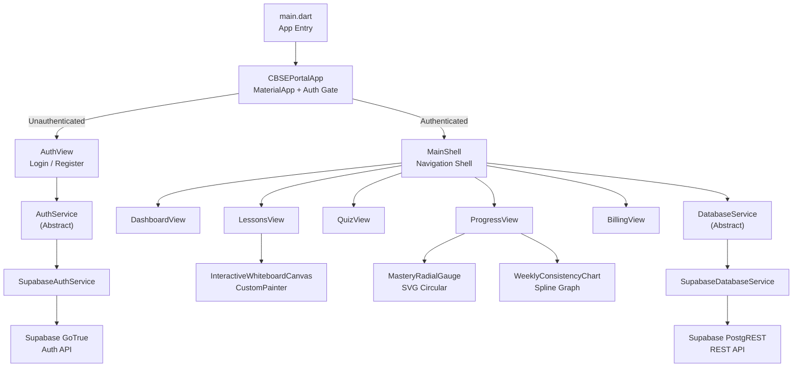
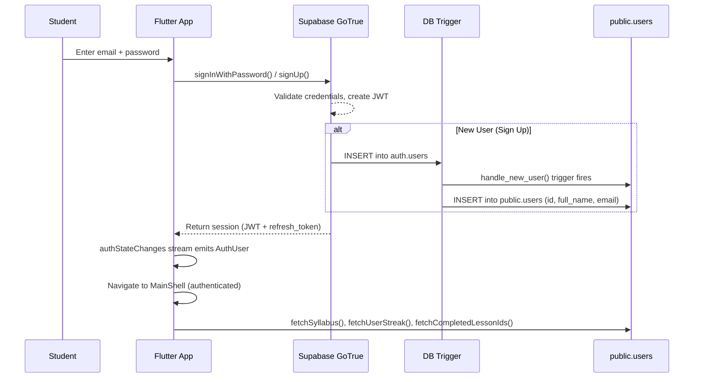
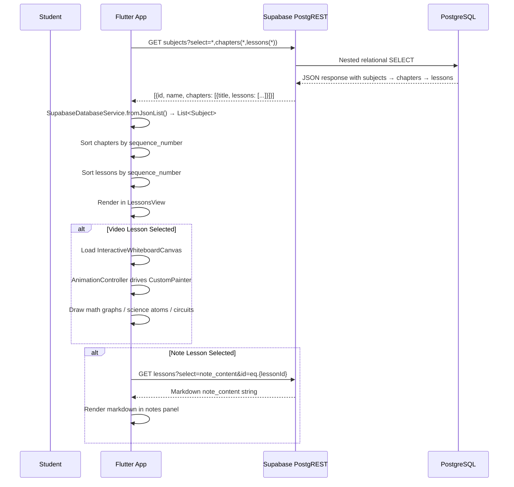
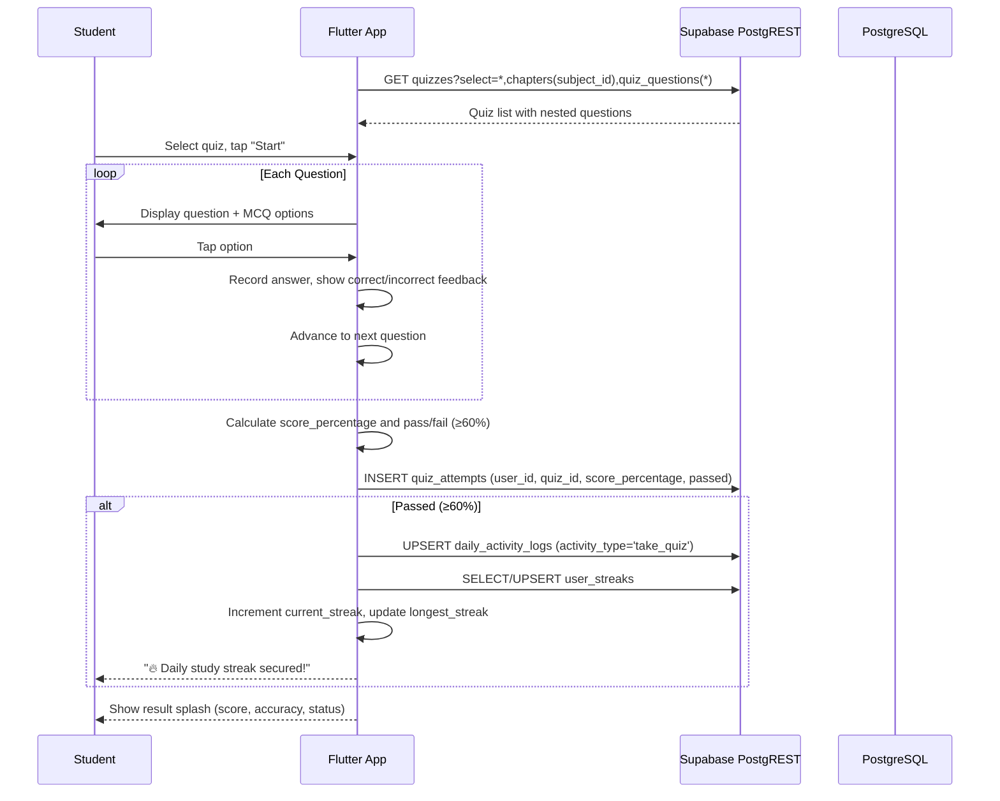
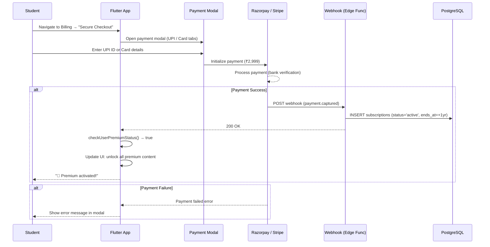
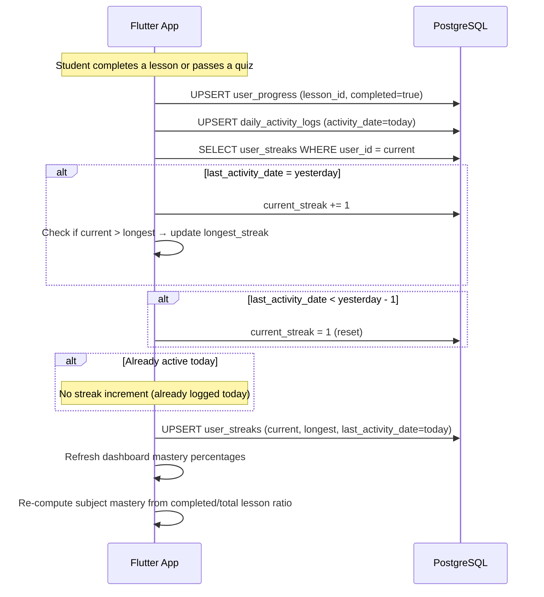
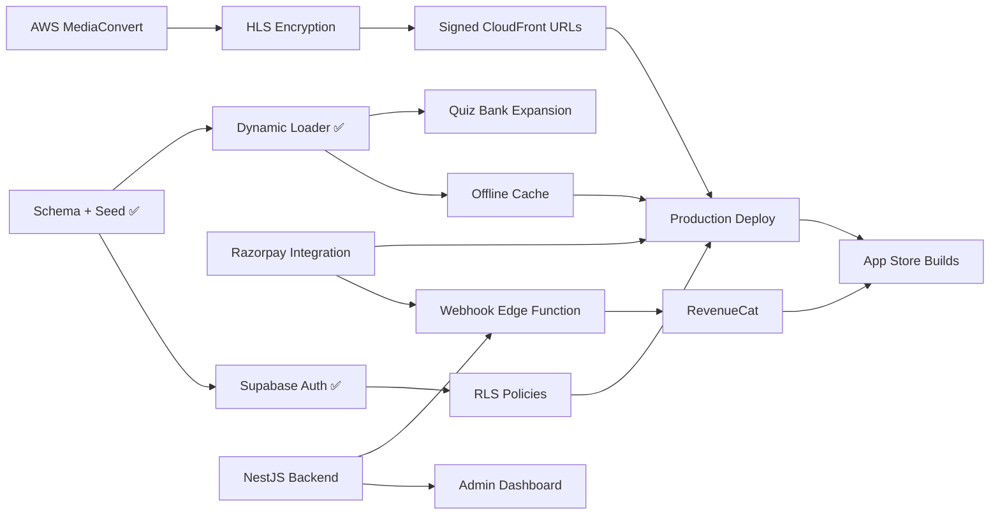

# 🏗️ CBSE Class 10 Learning Portal — Architecture Document

> **Document Version**: 1.0  
> **Last Updated**: 2026-06-23  
> **Status**: Active — reflects production codebase state  
> **Audience**: New developers, contributors, and code review agents

---

## Table of Contents

1. [System Overview](#1-system-overview)
2. [Tech Stack Map](#2-tech-stack-map)
3. [Component Architecture](#3-component-architecture)
4. [Data Flow](#4-data-flow)
5. [Database Schema](#5-database-schema)
6. [API Design](#6-api-design)
7. [Security](#7-security)
8. [Deployment](#8-deployment)
9. [Roadmap](#9-roadmap)
10. [Design System](#10-design-system)

---

## 1. System Overview

### 1.1 Purpose

The **CBSE Class 10 Online Learning Portal** (codename **CBSE Core**) is an interactive, high-performance educational platform designed to help CBSE Class 10 students master their board exam syllabus through:

- **Animated Video Lectures** rendered programmatically (zero-bandwidth vector whiteboards)
- **Structured Revision Notes** mirroring NCERT textbook typography and layout
- **Chapter-wise Practice Quizzes** with grading and mastery tracking
- **Gamified Streaks** that reward daily study consistency
- **Subscription-based Premium Access** with a free tier for trial content

### 1.2 User Personas

| Persona | Description | Capabilities |
|---------|-------------|-------------|
| **Student (Free)** | Class 10 learner on the free tier | View free lessons, attempt free quizzes, track streaks, view dashboard |
| **Student (Premium)** | Subscribed student with full access | All free features + premium chapters, offline downloads, full quiz bank, PDF export |
| **Admin** (Planned) | Content administrator | Upload/manage curriculum, view analytics, manage quiz banks |
| **Teacher** (Planned) | Classroom instructor | Assign chapters, view student progress dashboards, create custom quizzes |

### 1.3 Core Value Proposition

| Differentiator | Description |
|----------------|-------------|
| **Zero-bandwidth video** | Lessons are animated `CustomPainter` canvases, not pre-recorded MP4s. Scales to any resolution, works offline, and adapts to dark/light themes automatically. |
| **Textbook-faithful design** | UI precisely mirrors NCERT printed textbook styling (cream backgrounds, Georgia serif, magenta chapter numbers, orange "Do You Know?" callouts). |
| **India-first pricing** | ₹2,999/year (~₹250/month) with Razorpay/UPI integration. No recurring auto-renewals. |
| **Offline-first architecture** | HLS manifest caching, local DB fallback (planned Hive/SQLite), and service worker support. |

---

## 2. Tech Stack Map

### 2.1 Full Stack Diagram

```
┌─────────────────────────────────────────────────────────────────────────┐
│                          CLIENT LAYER                                   │
│                                                                         │
│   ┌───────────────┐  ┌───────────────┐  ┌───────────────┐              │
│   │  Android APK  │  │   iOS IPA     │  │  Flutter Web  │              │
│   │  (Play Store) │  │ (App Store)   │  │ (Firebase)    │              │
│   └───────┬───────┘  └───────┬───────┘  └───────┬───────┘              │
│           └──────────────────┼──────────────────┘                       │
│                              │                                          │
│                 ┌────────────▼────────────┐                             │
│                 │   Flutter (Dart) App    │                             │
│                 │   Single Codebase       │                             │
│                 │   supabase_flutter SDK  │                             │
│                 └────────────┬────────────┘                             │
└──────────────────────────────┼──────────────────────────────────────────┘
                               │  HTTPS / WebSocket
┌──────────────────────────────┼──────────────────────────────────────────┐
│                          BACKEND LAYER                                  │
│                                                                         │
│   ┌──────────────────────────▼──────────────────────────────┐          │
│   │                   Supabase (BaaS)                        │          │
│   │  ┌─────────────┐ ┌──────────────┐ ┌──────────────────┐  │          │
│   │  │  Auth (JWT)  │ │  PostgREST   │ │  Realtime (WS)   │  │          │
│   │  │  GoTrue      │ │  Auto-API    │ │  Subscriptions   │  │          │
│   │  └─────────────┘ └──────────────┘ └──────────────────┘  │          │
│   │  ┌─────────────┐ ┌──────────────┐ ┌──────────────────┐  │          │
│   │  │  Storage     │ │  Edge Funcs  │ │  Row Level       │  │          │
│   │  │  (S3-compat) │ │  (Deno)      │ │  Security (RLS)  │  │          │
│   │  └─────────────┘ └──────────────┘ └──────────────────┘  │          │
│   └──────────────────────────┬──────────────────────────────┘          │
│                              │                                          │
│   ┌──────────────────────────▼──────────────────────────────┐          │
│   │              PostgreSQL 14+ Database                     │          │
│   │   (users, subscriptions, chapters, lessons, quizzes,     │          │
│   │    user_progress, user_streaks, daily_activity_logs)      │          │
│   └─────────────────────────────────────────────────────────┘          │
│                                                                         │
│   ┌─────────────────────────────────────────────────────────┐          │
│   │           NestJS API (Planned — Future Phase)            │          │
│   │   TypeScript / Node.js / Express                         │          │
│   │   Webhook receiver, payment verification, admin API      │          │
│   └─────────────────────────────────────────────────────────┘          │
└─────────────────────────────────────────────────────────────────────────┘
                               │
┌──────────────────────────────┼──────────────────────────────────────────┐
│                     INFRASTRUCTURE LAYER                                │
│                                                                         │
│   ┌───────────────┐  ┌───────────────┐  ┌───────────────────┐          │
│   │  Firebase      │  │  AWS S3       │  │  AWS CloudFront   │          │
│   │  Hosting       │  │  (Video src)  │  │  (CDN + HLS)      │          │
│   └───────────────┘  └───────────────┘  └───────────────────┘          │
│   ┌───────────────┐  ┌───────────────┐  ┌───────────────────┐          │
│   │  AWS Lambda   │  │  MediaConvert │  │  Redis (Planned)   │          │
│   │  (Processing) │  │  (Transcode)  │  │  (Streaks cache)   │          │
│   └───────────────┘  └───────────────┘  └───────────────────┘          │
└─────────────────────────────────────────────────────────────────────────┘
```

### 2.2 Technology Justifications

| Technology | Role | Why This Choice |
|------------|------|-----------------|
| **Flutter (Dart)** | Cross-platform client | Single codebase for Android, iOS, and Web. `CustomPainter` enables GPU-accelerated programmatic whiteboard animations — the core differentiator. |
| **Supabase** | Backend-as-a-Service | Free tier includes PostgreSQL, Auth (GoTrue), PostgREST auto-API, Row Level Security, and Realtime. Eliminates need for a custom backend in MVP. |
| **PostgreSQL 14+** | Primary database | Strong relational modeling for curriculum hierarchies (subjects → chapters → lessons). JSONB for flexible quiz options. UUID primary keys for distributed safety. |
| **NestJS** (Planned) | Custom API layer | For webhook handling (Razorpay/Stripe), admin dashboard APIs, and complex business logic that can't run in Edge Functions. TypeScript for type-safety. |
| **Redis** (Planned) | Cache layer | Hot-path caching for streak counters, active video stream sessions, and leaderboard rankings. Eliminates repeat DB round-trips for gamification queries. |
| **Firebase Hosting** | Web deployment | Automatic SSL, global CDN, GitHub Actions integration, preview channels on PRs. Serves the Flutter Web build. |
| **AWS S3 + MediaConvert** | Video pipeline | Source video storage → transcoding to HLS adaptive bitrate manifests (360p/480p/720p/1080p). |
| **AWS CloudFront** | Video CDN | Low-latency HLS delivery with signed URLs for DRM-protected manifest files. AES-128 encrypted segments. |
| **Razorpay / Stripe** | Payment gateways | Razorpay for India-native UPI/card payments. Stripe for international card processing. Both support webhook-based verification. |
| **RevenueCat** (Planned) | Subscription management | Unified API across Apple IAP, Google Play Billing, and web payments. Handles receipt validation, entitlement checks, and analytics. |

---

## 3. Component Architecture

### 3.1 Monorepo Directory Layout

```
byAntiGravity/
├── .antigravity/                    # AI agent rules & workspace conventions
│   └── rules.md                     # NCERT theme tokens, responsive rules
├── .github/workflows/               # CI/CD pipelines
│   ├── firebase-hosting-merge.yml   # Deploy to live on main push
│   └── firebase-hosting-pull-request.yml  # Preview channel on PR
├── apps/
│   └── mobile_web_client/           # Flutter application (Android/iOS/Web)
│       └── lib/
│           ├── main.dart            # App entry, auth gate, MainShell navigation
│           ├── config.dart          # Supabase URL + Anon Key (env-injectable)
│           ├── models.dart          # Subject, Chapter, Lesson, Quiz, UserState
│           ├── theme.dart           # AppColors + AppThemes (light/dark)
│           ├── services/
│           │   ├── auth_service.dart     # AuthService interface + SupabaseAuthService
│           │   └── database_service.dart # DatabaseService interface + SupabaseDatabaseService
│           ├── views/
│           │   ├── auth_view.dart        # Login/Register/Reset password
│           │   ├── dashboard_view.dart   # Home dashboard with stats + subject cards
│           │   ├── lessons_view.dart     # Video player, lesson list, notes panel
│           │   ├── quiz_view.dart        # Quiz selector, active quiz, results
│           │   ├── progress_view.dart    # Mastery metrics, radial gauge, charts
│           │   └── billing_view.dart     # Subscription plans, checkout modal
│           ├── widgets/
│           │   ├── interactive_whiteboard_canvas.dart  # CustomPainter animators
│           │   ├── mastery_radial_gauge.dart           # Circular progress SVG
│           │   └── weekly_consistency_chart.dart       # Spline line chart
│           └── utils/
│               ├── download.dart          # Conditional import stub
│               ├── download_stub.dart     # Non-web fallback
│               └── download_web.dart      # Web-specific download logic
├── db/
│   ├── schema.sql                   # PostgreSQL DDL (10 tables, indexes, triggers)
│   └── seed.sql                     # NCERT content seed (3 subjects, 5 chapters, 14 lessons, 3 quizzes, 12 questions)
├── prototype/
│   ├── index.html                   # High-fidelity HTML/CSS/JS mockup
│   ├── styles.css                   # Prototype stylesheet
│   └── app.js                       # Prototype interactive logic
├── firebase.json                    # Firebase Hosting configuration
├── .firebaserc                      # Firebase project alias (cbse-portal-sagar)
├── README.md                        # Project overview
├── TODO.md                          # Production launch checklist
└── UNDERSTAND.md                    # Persistent AI agent memory
```

### 3.2 Flutter Client Architecture



### 3.3 View Components Detail

| View | File | Purpose | Key Widgets/Features |
|------|------|---------|---------------------|
| **AuthView** | `auth_view.dart` | Authentication gate | Email/password sign-in, sign-up with full name, password reset, NCERT-themed form styling, mock-auth fallback for offline testing |
| **DashboardView** | `dashboard_view.dart` | Student home screen | Streak banner, syllabus coverage stat, avg quiz score, study time, subject cards with mastery progress bars |
| **LessonsView** | `lessons_view.dart` | Content consumption | Subject tab bar, chapter accordion, lesson item list, embedded `InteractiveWhiteboardCanvas`, markdown notes renderer, video controls bar (play/pause, progress slider, quality selector, download), premium lock overlay |
| **QuizView** | `quiz_view.dart` | Knowledge testing | Quiz selector grid, active quiz with progress bar, MCQ option cards with correct/incorrect feedback, result splash with score/accuracy/status, streak notification on pass |
| **ProgressView** | `progress_view.dart` | Analytics dashboard | Board Readiness Index (radial gauge), topic-wise mastery bars, weekly study consistency spline chart, streak XP badge |
| **BillingView** | `billing_view.dart` | Monetization | Current tier display, pricing card (₹2,999/year), benefit list, UPI/Card checkout modal with simulated payment processing |

### 3.4 Service Layer Interfaces

#### AuthService (Abstract)

```dart
abstract class AuthService {
  Stream<AuthUser?> get authStateChanges;
  AuthUser? get currentUser;
  Future<AuthUser> signIn(String email, String password);
  Future<AuthUser> signUp(String email, String password, String fullName);
  Future<void> signOut();
  Future<void> resetPassword(String email);
}
```

#### DatabaseService (Abstract)

```dart
abstract class DatabaseService {
  Future<List<Subject>> fetchSyllabus();
  Future<String> fetchLessonNoteContent(String lessonId);
  Future<List<Quiz>> fetchQuizzes();
  Future<void> submitQuizAttempt({...});
  Future<int> fetchUserStreak();
  Future<int> recordActivityAndIncrementStreak({...});
  Future<void> recordLessonCompletion({...});
  Future<List<String>> fetchCompletedLessonIds();
  Future<bool> checkUserPremiumStatus();
  Future<void> createUserMockSubscription();
}
```

> **Design Decision**: Both services are declared as abstract interfaces with concrete Supabase implementations. This enables swapping to a NestJS-backed REST client or mock implementation without changing any view code.

### 3.5 Navigation Architecture

The app uses an **adaptive navigation shell** pattern:

| Screen Width | Navigation Style | Component |
|:---:|:---:|:---:|
| **> 800px** (desktop/tablet) | Left sidebar drawer (250px) | Dark-themed sidebar with brand logo, 5 nav items, user profile footer |
| **≤ 800px** (mobile) | Bottom navigation bar | `BottomNavigationBar` with 5 items |

Navigation state is managed via `_activeNavIndex` in `MainShell`, which indexes into the views list: `[Dashboard, Lessons, Quiz, Progress, Billing]`.

---

## 4. Data Flow

### 4.1 Authentication Flow



**Key Details:**
- Supabase GoTrue issues JWT tokens with user metadata embedded
- A PostgreSQL trigger (`on_auth_user_created`) automatically syncs `auth.users` → `public.users`
- The `full_name` is extracted from `raw_user_meta_data->>'full_name'` with fallback to `'Student'`
- JWTs are persisted in local storage for session resumption

### 4.2 Content Delivery Flow



**Programmatic Video Pipeline:**
1. No actual video files are streamed for math/science animations
2. `InteractiveWhiteboardCanvas` uses `CustomPainter` + `AnimationController`
3. Four render modes: `mathGraph` (cartesian plots), `scienceAtom` (orbital diagrams), `scienceCircuit` (Ohm's law circuits), `socialMap` (India map highlights)
4. All rendering is GPU-accelerated, resolution-independent, and theme-adaptive

### 4.3 Quiz Flow



### 4.4 Payment Flow



> **Current State**: The payment flow uses a `createUserMockSubscription()` method that inserts a mock `active` subscription directly into the database. Real Razorpay/Stripe integration is on the roadmap.

### 4.5 Streak & Progress Flow



**Mastery Calculation:**
```
subject_mastery = (completed_lessons_in_subject / total_lessons_in_subject) × 100
board_readiness = weighted_average(all_subject_masteries)
```

---

## 5. Database Schema

### 5.1 Entity Relationship Diagram

```mermaid
erDiagram
    USERS ||--o{ SUBSCRIPTIONS : "has"
    USERS ||--o{ USER_PROGRESS : "tracks"
    USERS ||--o{ USER_STREAKS : "maintains"
    USERS ||--o{ DAILY_ACTIVITY_LOGS : "logs"
    USERS ||--o{ QUIZ_ATTEMPTS : "attempts"

    SUBJECTS ||--o{ CHAPTERS : "contains"
    CHAPTERS ||--o{ LESSONS : "includes"
    CHAPTERS ||--o{ QUIZZES : "has"
    QUIZZES ||--o{ QUIZ_QUESTIONS : "contains"
    QUIZZES ||--o{ QUIZ_ATTEMPTS : "receives"
    
    LESSONS ||--o{ USER_PROGRESS : "referenced by"

    USERS {
        uuid id PK
        varchar full_name
        varchar email UK
        varchar password_hash "Nullable - Supabase manages"
        timestamptz created_at
        timestamptz updated_at
    }

    SUBSCRIPTIONS {
        uuid id PK
        uuid user_id FK
        enum status "free_tier|trialing|active|past_due|canceled|expired"
        varchar provider "razorpay|stripe|google_play|apple_appstore"
        varchar external_subscription_id UK
        varchar external_payment_id
        timestamptz starts_at
        timestamptz ends_at
        timestamptz created_at
    }

    SUBJECTS {
        uuid id PK
        varchar name UK
        varchar code UK
        text description
        varchar thumbnail_url
    }

    CHAPTERS {
        uuid id PK
        uuid subject_id FK
        varchar title
        int sequence_number
        text description
    }

    LESSONS {
        uuid id PK
        uuid chapter_id FK
        varchar title
        enum type "video|note"
        varchar video_hls_url
        int video_duration_seconds
        text note_content "Markdown formatted"
        boolean is_free
        int sequence_number
        timestamptz created_at
    }

    USER_PROGRESS {
        uuid id PK
        uuid user_id FK
        uuid lesson_id FK
        boolean completed
        int watch_time_seconds
        int mastery_score "0-100"
        timestamptz last_accessed_at
    }

    QUIZZES {
        uuid id PK
        uuid chapter_id FK
        varchar title
        int passing_percentage "default 60"
    }

    QUIZ_QUESTIONS {
        uuid id PK
        uuid quiz_id FK
        text question_text
        enum type "multiple_choice|true_false|short_answer"
        jsonb options "Array of option strings"
        int correct_option_index
        text correct_answer_text
        int marks
    }

    QUIZ_ATTEMPTS {
        uuid id PK
        uuid user_id FK
        uuid quiz_id FK
        int score_percentage "0-100"
        boolean passed
        timestamptz attempted_at
    }

    USER_STREAKS {
        uuid id PK
        uuid user_id FK UK
        int current_streak
        int longest_streak
        date last_activity_date
        timestamptz updated_at
    }

    DAILY_ACTIVITY_LOGS {
        uuid id PK
        uuid user_id FK
        date activity_date
        varchar activity_type "watch_video|read_note|take_quiz"
        uuid reference_id
        timestamptz created_at
    }
```

### 5.2 Key Design Decisions

| Decision | Rationale |
|----------|-----------|
| **UUIDs everywhere** | `uuid_generate_v4()` for all primary keys. Prevents ID collision in distributed systems and between Supabase auth and public schemas. |
| **ENUM types for status** | `subscription_status`, `lesson_type`, `question_type` are PostgreSQL ENUMs. Enforces valid values at DB level without application-side validation. |
| **JSONB for quiz options** | `quiz_questions.options` stores `["A. Newton", "B. Einstein", ...]` as JSONB. Flexible for variable option counts without a separate options table. |
| **Composite unique constraints** | `UNIQUE(user_id, lesson_id)` on `user_progress`, `UNIQUE(subject_id, sequence_number)` on chapters, `UNIQUE(chapter_id, sequence_number)` on lessons. Prevents duplicate entries and enforces ordering. |
| **Trigger-based user sync** | `handle_new_user()` trigger auto-creates a `public.users` row when `auth.users` gets a new entry. This bridges Supabase's auth schema with the application's public schema. |
| **Date-based streak logic** | `user_streaks.last_activity_date` is a `DATE` type (not timestamp). Streak comparison checks `today - last_activity = 1 day` for increment, `> 1 day` for reset. |
| **CHECK constraints** | `mastery_score` bounded 0-100, `passing_percentage` bounded 1-100, `ends_at > starts_at` on subscriptions. Database-level data integrity. |

### 5.3 Indexes

```sql
CREATE INDEX idx_user_progress_user       ON user_progress(user_id);
CREATE INDEX idx_lessons_chapter          ON lessons(chapter_id);
CREATE INDEX idx_quiz_attempts_user       ON quiz_attempts(user_id);
CREATE INDEX idx_daily_activity_user_date ON daily_activity_logs(user_id, activity_date);
CREATE INDEX idx_subscriptions_user_status ON subscriptions(user_id, status);
```

These indexes optimize the most frequent query patterns:
- Fetching a student's progress across all lessons
- Loading lessons for a specific chapter
- Retrieving quiz history for a user
- Checking daily activity for streak calculations
- Verifying subscription status

### 5.4 Current Seed Data

| Entity | Count | Details |
|--------|-------|---------|
| Subjects | 3 | Mathematics, Science, Social Science |
| Chapters | 5 | Real Numbers, Polynomials, Chemical Reactions, Electricity, Nationalism in India |
| Lessons | 14 | 10 video lessons + 4 revision note lessons |
| Quizzes | 3 | Maths Ch1, Maths Ch2, Science Ch1 |
| Quiz Questions | 12 | All MCQ format with 4 options each |

---

## 6. API Design

### 6.1 Current API Surface (Supabase PostgREST Auto-API)

The Flutter client communicates directly with Supabase PostgREST. All requests include an `Authorization: Bearer <JWT>` header.

#### Content Read Endpoints

| Method | Endpoint | Description | Response Shape |
|--------|----------|-------------|----------------|
| `GET` | `/rest/v1/subjects?select=*,chapters(*,lessons(*))` | Fetch full syllabus tree | `[{id, name, code, description, chapters: [{title, sequence_number, lessons: [{...}]}]}]` |
| `GET` | `/rest/v1/lessons?select=note_content&id=eq.{id}` | Fetch single lesson's note content | `{note_content: "# Markdown..."}` |
| `GET` | `/rest/v1/quizzes?select=*,chapters(subject_id),quiz_questions(*)` | Fetch quizzes with questions | `[{id, title, chapters: {subject_id}, quiz_questions: [{...}]}]` |

#### User Progress Endpoints

| Method | Endpoint | Description | Request Body |
|--------|----------|-------------|-------------|
| `GET` | `/rest/v1/user_progress?user_id=eq.{uid}&completed=eq.true&select=lesson_id` | Fetch completed lesson IDs | — |
| `POST` | `/rest/v1/user_progress` | Record lesson completion (upsert) | `{user_id, lesson_id, completed: true, watch_time_seconds, mastery_score}` |
| `GET` | `/rest/v1/user_streaks?user_id=eq.{uid}&select=current_streak` | Fetch current streak | — |
| `POST` | `/rest/v1/user_streaks` | Upsert streak record | `{user_id, current_streak, longest_streak, last_activity_date}` |
| `POST` | `/rest/v1/daily_activity_logs` | Log daily activity (upsert) | `{user_id, activity_date, activity_type, reference_id}` |

#### Quiz Endpoints

| Method | Endpoint | Description | Request Body |
|--------|----------|-------------|-------------|
| `POST` | `/rest/v1/quiz_attempts` | Submit quiz attempt | `{user_id, quiz_id, score_percentage, passed}` |

#### Subscription Endpoints

| Method | Endpoint | Description |
|--------|----------|-------------|
| `GET` | `/rest/v1/subscriptions?user_id=eq.{uid}&status=in.(active,trialing)&ends_at=gt.{now}` | Check premium status |
| `POST` | `/rest/v1/subscriptions` | Create subscription record | 

#### Auth Endpoints (Supabase GoTrue)

| Method | Endpoint | Description |
|--------|----------|-------------|
| `POST` | `/auth/v1/signup` | Register new user |
| `POST` | `/auth/v1/token?grant_type=password` | Sign in with email/password |
| `POST` | `/auth/v1/logout` | Sign out (invalidate session) |
| `POST` | `/auth/v1/recover` | Send password reset email |

### 6.2 Planned NestJS API Endpoints (Future Phase)

When the NestJS backend is implemented, these endpoints will handle operations that require server-side logic beyond PostgREST:

```
POST /api/payments/razorpay/webhook      # Razorpay payment webhook receiver
POST /api/payments/stripe/webhook        # Stripe payment webhook receiver
POST /api/payments/verify                # Verify payment receipt manually
GET  /api/admin/students                 # Admin: list all students
GET  /api/admin/students/:id/progress    # Admin: view student progress
POST /api/admin/content/chapters         # Admin: create/update chapters
POST /api/admin/content/lessons          # Admin: create/update lessons
POST /api/admin/quizzes                  # Admin: create/update quiz banks
GET  /api/analytics/engagement           # Analytics: daily/weekly metrics
GET  /api/analytics/revenue              # Analytics: subscription metrics
POST /api/video/signed-url               # Generate signed CloudFront URL for HLS
```

---

## 7. Security

### 7.1 Authentication Architecture

| Component | Implementation |
|-----------|---------------|
| **Auth Provider** | Supabase GoTrue (self-hosted fork of Netlify GoTrue) |
| **Token Format** | JWT (JSON Web Tokens) with RS256 signing |
| **Session Storage** | `supabase_flutter` SDK manages token persistence in secure local storage |
| **Token Refresh** | Automatic refresh via refresh_token before JWT expiry |
| **Password Hashing** | bcrypt (handled by GoTrue internally; `password_hash` column in `users` table is nullable since Supabase manages this in `auth.users`) |
| **Password Reset** | Email-based reset flow via `resetPasswordForEmail()` |

### 7.2 Row Level Security (RLS) Policies (Planned)

> **Status**: RLS policies are defined in the TODO but not yet implemented. Below are the planned policies.

```sql
-- Enable RLS on all tables
ALTER TABLE users ENABLE ROW LEVEL SECURITY;
ALTER TABLE user_progress ENABLE ROW LEVEL SECURITY;
ALTER TABLE user_streaks ENABLE ROW LEVEL SECURITY;
ALTER TABLE quiz_attempts ENABLE ROW LEVEL SECURITY;
ALTER TABLE daily_activity_logs ENABLE ROW LEVEL SECURITY;
ALTER TABLE subscriptions ENABLE ROW LEVEL SECURITY;

-- Students can only read their own profile
CREATE POLICY "Users can read own profile"
  ON users FOR SELECT
  USING (auth.uid() = id);

-- Students can only read/write their own progress
CREATE POLICY "Users can manage own progress"
  ON user_progress FOR ALL
  USING (auth.uid() = user_id);

-- Students can only read/write their own streaks
CREATE POLICY "Users can manage own streaks"
  ON user_streaks FOR ALL
  USING (auth.uid() = user_id);

-- Students can only insert/read their own quiz attempts
CREATE POLICY "Users can manage own quiz attempts"
  ON quiz_attempts FOR ALL
  USING (auth.uid() = user_id);

-- Students can only read/write their own activity logs
CREATE POLICY "Users can manage own activity logs"
  ON daily_activity_logs FOR ALL
  USING (auth.uid() = user_id);

-- Subscriptions: users can read own, only backend can insert/update
CREATE POLICY "Users can read own subscriptions"
  ON subscriptions FOR SELECT
  USING (auth.uid() = user_id);

-- Course content: readable by all authenticated users
CREATE POLICY "Authenticated users can read subjects"
  ON subjects FOR SELECT
  USING (auth.role() = 'authenticated');

CREATE POLICY "Authenticated users can read chapters"
  ON chapters FOR SELECT
  USING (auth.role() = 'authenticated');

-- Lessons: free lessons readable by all; paid lessons only by premium users
CREATE POLICY "Free lessons readable by all authenticated"
  ON lessons FOR SELECT
  USING (
    auth.role() = 'authenticated'
    AND (
      is_free = true
      OR EXISTS (
        SELECT 1 FROM subscriptions
        WHERE user_id = auth.uid()
        AND status IN ('active', 'trialing')
        AND ends_at > NOW()
      )
    )
  );

-- Quiz questions: hide correct_option_index from client
-- (Handled via PostgREST column-level permissions or Edge Function proxy)
```

### 7.3 Video Content Protection (HLS Encryption)

| Layer | Mechanism | Status |
|-------|-----------|--------|
| **Transport** | HTTPS (TLS 1.3) for all CloudFront requests | ✅ Active |
| **Segment Encryption** | AES-128 encryption on HLS `.ts` segments | 🔲 Planned |
| **Key Delivery** | Signed CloudFront URLs for `.m3u8` manifests and AES key files | 🔲 Planned |
| **Token Validation** | Short-lived signed URLs (15-minute expiry) generated server-side | 🔲 Planned |
| **DRM** (Future) | Widevine (Android) + FairPlay (iOS) for native app builds | 🔲 Future |

**Planned HLS encryption pipeline:**
```
Source Video (S3) → MediaConvert (Transcode + AES-128 encrypt)
                   → Output HLS manifests + encrypted .ts segments (S3)
                   → CloudFront distribution with signed URLs
                   → Client requests signed manifest URL from NestJS API
                   → Client plays encrypted stream via video_player package
```

### 7.4 Payment Security

| Concern | Approach |
|---------|----------|
| **PCI Compliance** | Card data never touches our servers. Razorpay/Stripe handles tokenization client-side. |
| **Webhook Verification** | Razorpay webhooks are verified via HMAC-SHA256 signature. Stripe uses Webhook Signing Secret. |
| **Subscription Verification** | Premium status is checked server-side via `subscriptions` table query, not client-side flags. |
| **Idempotent payments** | `external_subscription_id` has a UNIQUE constraint to prevent duplicate subscription records. |
| **Double-spending protection** | `CHECK (ends_at > starts_at)` constraint ensures valid subscription windows. |

### 7.5 Environment Variable Security

```dart
// config.dart — values are injectable at build time
static const String supabaseUrl = String.fromEnvironment(
  'SUPABASE_URL',
  defaultValue: 'https://ervvgjioggfxygtjlpts.supabase.co',
);
static const String supabaseAnonKey = String.fromEnvironment(
  'SUPABASE_ANON_KEY',
  defaultValue: '...',
);
```

- **Anon Key** is the public-facing key with RLS-enforced permissions (safe to embed in client)
- **Service Role Key** (admin) is never stored in client code — used only in CI/CD and Edge Functions
- Build-time injection: `flutter build web --dart-define=SUPABASE_URL=...`

---

## 8. Deployment

### 8.1 Deployment Architecture

```
┌─────────────────────────────────────────────────────────────┐
│                    GitHub Repository                         │
│                    (byAntiGravity)                            │
│                                                              │
│   push to main ──────────┐                                   │
│   pull request ────┐      │                                   │
│                    │      │                                   │
│                    ▼      ▼                                   │
│   ┌────────────────────────────────────┐                     │
│   │      GitHub Actions Workflow       │                     │
│   │                                    │                     │
│   │  1. actions/checkout@v4            │                     │
│   │  2. subosito/flutter-action@v2     │                     │
│   │  3. flutter pub get                │                     │
│   │  4. flutter build web --release    │                     │
│   │  5. Firebase deploy                │                     │
│   └────────────────┬───────────────────┘                     │
│                    │                                          │
└────────────────────┼──────────────────────────────────────────┘
                     │
                     ▼
   ┌─────────────────────────────────────┐
   │        Firebase Hosting             │
   │   Project: cbse-portal-sagar        │
   │                                     │
   │   PR → Preview Channel              │
   │   main push → Live Channel           │
   │                                     │
   │   Serves: apps/mobile_web_client/   │
   │           build/web/                │
   │                                     │
   │   SPA Rewrites: ** → /index.html    │
   └─────────────────────────────────────┘
```

### 8.2 CI/CD Pipelines

| Workflow | Trigger | Action | Output |
|----------|---------|--------|--------|
| `firebase-hosting-pull-request.yml` | Any PR opened | Build Flutter Web → Deploy to Firebase **preview channel** | Ephemeral preview URL in PR comments |
| `firebase-hosting-merge.yml` | Push to `main` | Build Flutter Web → Deploy to Firebase **live channel** | Production deployment |

**Required GitHub Secrets:**
- `FIREBASE_SERVICE_ACCOUNT_CBSE_PORTAL_SAGAR` — Firebase service account JSON for automated deployments
- `GITHUB_TOKEN` — Auto-provided by GitHub for PR comments

### 8.3 Firebase Hosting Configuration

```json
{
  "hosting": {
    "public": "apps/mobile_web_client/build/web",
    "ignore": ["firebase.json", "**/.*", "**/node_modules/**"],
    "rewrites": [
      { "source": "**", "destination": "/index.html" }
    ]
  }
}
```

- **SPA rewrite**: All routes serve `index.html` (Flutter handles client-side routing)
- **Build output**: `apps/mobile_web_client/build/web/` (Flutter Web release build)

### 8.4 Supabase Infrastructure

| Component | Configuration |
|-----------|---------------|
| **Project** | `ervvgjioggfxygtjlpts.supabase.co` |
| **Tier** | Free tier (suitable for MVP/beta) |
| **Region** | Auto-selected (closest to India for latency) |
| **Database** | PostgreSQL 14+ with 500MB storage |
| **Auth** | Email/password authentication enabled |
| **Edge Functions** | Deno runtime (planned for webhook receivers) |

### 8.5 AWS Infrastructure (Planned)

| Service | Purpose | Configuration |
|---------|---------|---------------|
| **S3** | Source video storage | Private bucket with lifecycle policies |
| **MediaConvert** | Video transcoding | HLS output: 360p, 480p, 720p, 1080p adaptive bitrate |
| **CloudFront** | CDN distribution | Edge locations in India, signed URL access, custom error pages |
| **Lambda** | Processing triggers | S3 upload → trigger MediaConvert job → update lesson `video_hls_url` |

### 8.6 App Store Deployment (Planned)

| Platform | Steps Required | Status |
|----------|---------------|--------|
| **Google Play** | Generate keystore → `flutter build appbundle` → Upload to Play Console | 🔲 Not started |
| **Apple App Store** | Apple Developer Program → Provisioning profiles → `flutter build ipa` → TestFlight → App Store Connect | 🔲 Not started |
| **Custom Domain** | Connect `cbsecore.com` (planned) to Firebase Hosting | 🔲 Not started |

---

## 9. Roadmap

### 9.1 Current State (as of 2026-06-23)

#### ✅ Completed

| Feature | Details |
|---------|---------|
| **Database Schema** | 10 tables with constraints, indexes, triggers, ENUMs |
| **Content Seeding** | 3 subjects, 5 chapters, 14 lessons (with full NCERT markdown notes), 3 quizzes, 12 MCQs |
| **Supabase Auth Integration** | Email/password login, signup, logout, password reset, auto user sync trigger |
| **Dynamic Curriculum Loader** | Subjects, chapters, and lessons fetched from Supabase at runtime (no hardcoded data) |
| **Flutter Multi-Platform UI** | 6 views (Auth, Dashboard, Lessons, Quiz, Progress, Billing) with responsive sidebar/bottom-nav |
| **NCERT Textbook Theme** | Cream backgrounds, Georgia serif, Outfit sans-serif, magenta/sky-blue/orange accents |
| **Programmatic Whiteboard Canvas** | 4 animation types: math graphs, atom orbits, circuit diagrams, India map |
| **Interactive Prototype** | Full HTML/CSS/JS mockup in `prototype/` with dark mode, canvas animations, mock checkout |
| **CI/CD Pipeline** | GitHub Actions → Flutter Web build → Firebase Hosting (live + PR previews) |
| **Quiz Engine** | Load quizzes from DB, grade MCQs client-side, submit attempts to DB |
| **Streak Tracking** | Record daily activity, increment/reset streaks, log to DB |
| **Mock Subscription Flow** | Simulated payment creates a 1-year active subscription in DB |

#### 🔧 Partially Complete

| Feature | Done | Remaining |
|---------|------|-----------|
| **Dynamic Curriculum Loader** | ✅ Fetch from Supabase | 🔲 Offline caching (Hive/SQLite) |
| **Progress Tracking** | ✅ Record completions | 🔲 Aggregate analytics, study time tracking |

### 9.2 Phase 2: Core Features

| Priority | Feature | Dependencies | Estimated Effort |
|:--------:|---------|-------------|:----------------:|
| 🔴 P0 | **Quiz Bank Expansion** | Textbook source material (90 PDFs connected via `--add-dir`) | 2 weeks |
| 🔴 P0 | **Row Level Security (RLS)** | — | 1 week |
| 🔴 P0 | **Offline Caching** (Hive/SQLite) | Local DB package integration | 2 weeks |
| 🟡 P1 | **Progress Dashboard** (server-computed) | user_progress data populated | 1 week |
| 🟡 P1 | **Real Razorpay Integration** | Razorpay merchant account, webhook endpoint | 2 weeks |

### 9.3 Phase 3: Production Hardening

| Priority | Feature | Dependencies |
|:--------:|---------|-------------|
| 🔴 P0 | **HLS Video Encryption** (AES-128) | AWS MediaConvert + CloudFront setup |
| 🟡 P1 | **Performance Optimization** | GZIP on Firebase, pre-render critical assets |
| 🟡 P1 | **Custom Domain** (`cbsecore.com`) | DNS configuration + Firebase Hosting |
| 🟢 P2 | **NestJS Backend API** | Webhook receiver, admin APIs |
| 🟢 P2 | **Redis Streak Cache** | Redis instance provisioning |

### 9.4 Phase 4: App Store Launch

| Priority | Feature | Dependencies |
|:--------:|---------|-------------|
| 🔴 P0 | **Android Build** (Google Play) | Production keystore, Play Console account |
| 🔴 P0 | **iOS Build** (App Store) | Apple Developer Program, provisioning profiles |
| 🟡 P1 | **RevenueCat Integration** | Apple IAP + Google Play Billing setup |
| 🟢 P2 | **Teacher/Admin Dashboard** | NestJS API, admin auth roles |

### 9.5 Feature Dependency Graph



---

## 10. Design System

### 10.1 NCERT Textbook Theme

The application's visual identity is derived from **printed NCERT Class 10 textbooks**, creating a familiar, trustworthy aesthetic for students.

#### Color Tokens

| Token | Hex | Usage | Preview |
|-------|-----|-------|---------|
| **Scaffold Paper (Light)** | `#FAF9F6` | Light mode background — warm cream paper | 🟨 |
| **Scaffold Dark** | `#0F172A` | Dark mode background — deep slate | ⬛ |
| **Text Primary (Light)** | `#0F172A` | Headings, body text | ⬛ |
| **Text Secondary (Light)** | `#334155` | Captions, metadata | 🔘 |
| **Text Primary (Dark)** | `#F8FAFC` | Dark mode headings | ⬜ |
| **Text Secondary (Dark)** | `#CBD5E1` | Dark mode captions | 🔘 |
| **NCERT Magenta** | `#BE185D` | Chapter numbers, warning text, list bullets, primary accent | 🟥 |
| **NCERT Sky Blue** | `#0284C7` | Chapter titles, section headers, drop caps | 🟦 |
| **NCERT Orange** | `#EA580C` | "Do You Know?" callout blocks, streak fire icons | 🟧 |
| **Success Green** | `#10B981` | Correct answers, completion badges, benefit checkmarks | 🟩 |
| **Card Light** | `#FFFFFF` | Light mode card surface | ⬜ |
| **Card Dark** | `#1E293B` | Dark mode card surface | 🔲 |
| **Border Light** | `#E2E8F0` | Light mode dividers | — |
| **Border Dark** | `#334155` | Dark mode dividers | — |

#### Typography

| Role | Font Family | Weight | Size | Usage |
|------|-------------|--------|------|-------|
| **UI Headings** | `Outfit` (sans-serif) | Bold (700) | 24px | Page titles, dashboard headers |
| **UI Subheadings** | `Outfit` | SemiBold (600) | 16-20px | Section headers, card titles |
| **UI Body** | `Outfit` | Regular (400) | 12-14px | Buttons, labels, metadata |
| **Reading Text** | `Georgia` (serif) | Regular | 14.5px | Notes content, lesson transcripts, list items |
| **Reading Body** | `Georgia` | Regular | 12.5px | Figure captions, secondary reading text |
| **Warning Callouts** | `Georgia` | Italic | 13px | "CAUTION" tags, exam warnings |

> **Rule**: All reading/content text uses `Georgia` to match the printed textbook feel. All interactive UI chrome uses `Outfit` for modern clarity.

### 10.2 Textbook Visual Components

The prototype and Flutter app include purpose-built NCERT-faithful components:

| Component | Description |
|-----------|-------------|
| **Drop Cap** | First letter of each section is oversized and colored NCERT Sky Blue `#0284C7` |
| **Square Bullets** | Pink/magenta (`#BE185D`) filled squares instead of standard bullet points |
| **"Do You Know?" Box** | Orange-bordered callout with `#EA580C` header text |
| **Activity Box** | Blue-bordered box with numbered activity header for lab instructions |
| **CAUTION Tag** | Magenta text label inline before safety warnings |
| **Figure Box** | SVG diagrams with dashed leader lines and Georgia serif captions |
| **QR Code** | Programmatically drawn SVG QR code mimicking textbook chapter QR codes |
| **Quote Container** | Italicized opening quote with author attribution, matching textbook page 1 format |
| **Chapter Header** | Two-part layout: flask icon + chapter number block + title (mimics NCERT chapter opener pages) |

### 10.3 Responsive Layout Rules

```
┌────────────────────────────────────────────────────────┐
│                     Screen Width                        │
│                                                         │
│   > 900px (Desktop)           ≤ 900px (Mobile)         │
│   ┌────────┬─────────────┐    ┌─────────────────────┐  │
│   │Sidebar │  Content    │    │     Content          │  │
│   │ 250px  │  Remaining  │    │                     │  │
│   │        │             │    │                     │  │
│   │ [Nav]  │  [Views]    │    │     [Views]         │  │
│   │        │             │    │                     │  │
│   │ [User] │             │    ├─────────────────────┤  │
│   └────────┴─────────────┘    │ [Bottom Nav Bar]    │  │
│                                └─────────────────────┘  │
└────────────────────────────────────────────────────────┘
```

| Rule | Breakpoint | Behavior |
|------|-----------|----------|
| **Navigation Shell** | `> 800px` → Sidebar drawer; `≤ 800px` → Bottom nav bar | Breakpoint at 800px in Flutter, 900px in prototype |
| **Grid Columns** | `> 900px` → 3 columns; `> 600px` → 2 columns; `≤ 600px` → 1 column | Subject cards, chapter grids |
| **Side-by-Side Panels** | `> 900px` → Activity box + Figure diagram side-by-side | Textbook layouts use `LayoutBuilder` in Flutter |
| **Video + Notes** | `> 800px` → Lessons sidebar (left) + Player/notes (right) | Stacks vertically on mobile |

### 10.4 Programmatic Vector Whiteboard

Instead of storing and streaming heavy video files, the portal generates animated visual explanations using GPU-accelerated canvas rendering:

#### Architecture

```dart
class InteractiveWhiteboardCanvas extends StatefulWidget { ... }

class _InteractiveWhiteboardCanvasState extends State<...>
    with SingleTickerProviderStateMixin {
  late AnimationController _controller;  // 0.0 → 1.0 loop
  
  @override
  void initState() {
    _controller = AnimationController(
      vsync: this,
      duration: Duration(seconds: 10),
    )..repeat();
  }
  
  @override
  Widget build(BuildContext context) {
    return CustomPaint(
      painter: WhiteboardPainter(
        progress: _controller.value,
        type: widget.videoType,      // mathGraph | scienceAtom | ...
        isDark: Theme.of(context).brightness == Brightness.dark,
      ),
    );
  }
}
```

#### Render Modes

| Mode | Animation | Canvas Operations |
|------|-----------|-------------------|
| **mathGraph** | Animated polynomial/trigonometric curves | Cartesian grid, sine/cosine plot with evolving phase, labeled intercepts, highlighted zeros |
| **scienceAtom** | Electron orbital model | Central nucleus (protons/neutrons), 3 elliptical orbits at different angles, orbiting electrons with trail effects |
| **scienceCircuit** | Ohm's law circuit diagram | Battery, wires, resistors with flowing current dots, animated voltage/current values |
| **socialMap** | India movement highlights | India outline, pulsing highlight points for Champaran/Kheda/Ahmedabad, animated timeline labels |

#### Benefits Over Traditional Video

| Metric | Pre-recorded Video | Programmatic Canvas |
|--------|-------------------|-------------------|
| **Storage** | ~50MB per lesson | 0 bytes (code-generated) |
| **Bandwidth** | 720p = ~3GB/hr streaming | 0 bytes (renders locally) |
| **Resolution** | Fixed (720p/1080p) | Infinite (vector-based) |
| **Dark Mode** | Requires separate recording | Automatic theme adaptation |
| **Interactivity** | Passive playback only | Touch/click events possible |
| **Offline** | Requires download cache | Works immediately (code is the content) |

### 10.5 Dark Mode Implementation

| Property | Light Mode | Dark Mode |
|----------|-----------|-----------|
| Scaffold background | `#FAF9F6` (cream) | `#0F172A` (slate) |
| Card surface | `#FFFFFF` | `#1E293B` |
| Primary text | `#0F172A` | `#F8FAFC` |
| Secondary text | `#334155` | `#CBD5E1` |
| Borders | `#E2E8F0` | `#334155` |
| Canvas grid lines | `rgba(0,0,0,0.04)` | `rgba(255,255,255,0.04)` |
| Chart curves | Same accent colors | Same accent colors |

Theme is toggled via `_themeMode` state in `CBSEPortalApp` and persisted to `localStorage` (prototype) or system preferences (Flutter).

---

## Appendix A: File Reference Index

| File | Purpose | Lines |
|------|---------|:-----:|
| [main.dart](file:///home/sagarv/Projects/byAntiGravity/apps/mobile_web_client/lib/main.dart) | App entry, auth gate, MainShell navigation | 638 |
| [models.dart](file:///home/sagarv/Projects/byAntiGravity/apps/mobile_web_client/lib/models.dart) | Data models: Subject, Chapter, Lesson, Quiz, UserState | 102 |
| [theme.dart](file:///home/sagarv/Projects/byAntiGravity/apps/mobile_web_client/lib/theme.dart) | AppColors + AppThemes (light/dark) | 90 |
| [config.dart](file:///home/sagarv/Projects/byAntiGravity/apps/mobile_web_client/lib/config.dart) | Supabase URL/Key (env-injectable) | 19 |
| [auth_service.dart](file:///home/sagarv/Projects/byAntiGravity/apps/mobile_web_client/lib/services/auth_service.dart) | AuthService interface + SupabaseAuthService | 116 |
| [database_service.dart](file:///home/sagarv/Projects/byAntiGravity/apps/mobile_web_client/lib/services/database_service.dart) | DatabaseService interface + SupabaseDatabaseService | 377 |
| [auth_view.dart](file:///home/sagarv/Projects/byAntiGravity/apps/mobile_web_client/lib/views/auth_view.dart) | Login/Register/Reset views | ~500 |
| [dashboard_view.dart](file:///home/sagarv/Projects/byAntiGravity/apps/mobile_web_client/lib/views/dashboard_view.dart) | Home dashboard | ~400 |
| [lessons_view.dart](file:///home/sagarv/Projects/byAntiGravity/apps/mobile_web_client/lib/views/lessons_view.dart) | Video player + notes | ~1400 |
| [quiz_view.dart](file:///home/sagarv/Projects/byAntiGravity/apps/mobile_web_client/lib/views/quiz_view.dart) | Quiz engine | ~500 |
| [progress_view.dart](file:///home/sagarv/Projects/byAntiGravity/apps/mobile_web_client/lib/views/progress_view.dart) | Mastery analytics | ~250 |
| [billing_view.dart](file:///home/sagarv/Projects/byAntiGravity/apps/mobile_web_client/lib/views/billing_view.dart) | Subscription + checkout | ~550 |
| [interactive_whiteboard_canvas.dart](file:///home/sagarv/Projects/byAntiGravity/apps/mobile_web_client/lib/widgets/interactive_whiteboard_canvas.dart) | CustomPainter animations | ~350 |
| [mastery_radial_gauge.dart](file:///home/sagarv/Projects/byAntiGravity/apps/mobile_web_client/lib/widgets/mastery_radial_gauge.dart) | Circular progress widget | ~70 |
| [weekly_consistency_chart.dart](file:///home/sagarv/Projects/byAntiGravity/apps/mobile_web_client/lib/widgets/weekly_consistency_chart.dart) | Spline line chart | ~100 |
| [schema.sql](file:///home/sagarv/Projects/byAntiGravity/db/schema.sql) | PostgreSQL DDL | 157 |
| [seed.sql](file:///home/sagarv/Projects/byAntiGravity/db/seed.sql) | NCERT content seed data | 260 |
| [index.html](file:///home/sagarv/Projects/byAntiGravity/prototype/index.html) | Interactive HTML prototype | 626 |
| [app.js](file:///home/sagarv/Projects/byAntiGravity/prototype/app.js) | Prototype application logic | 1415 |
| [rules.md](file:///home/sagarv/Projects/byAntiGravity/.antigravity/rules.md) | AI agent theme/layout rules | 38 |
| [TODO.md](file:///home/sagarv/Projects/byAntiGravity/TODO.md) | Production launch checklist | 67 |
| [UNDERSTAND.md](file:///home/sagarv/Projects/byAntiGravity/UNDERSTAND.md) | Persistent workspace memory | 54 |

---

## Appendix B: Glossary

| Term | Definition |
|------|-----------|
| **HLS** | HTTP Live Streaming — Apple's adaptive bitrate streaming protocol. Videos are split into small `.ts` segments referenced by `.m3u8` manifests. |
| **RLS** | Row Level Security — PostgreSQL feature where access policies are defined per-table, evaluated on every query. |
| **PostgREST** | Automatic REST API layer that Supabase places in front of PostgreSQL. Every table becomes an API endpoint. |
| **GoTrue** | Supabase's authentication service (fork of Netlify GoTrue). Handles signup, login, JWT issuance, and password reset. |
| **CustomPainter** | Flutter's low-level drawing API that provides direct canvas access for GPU-accelerated 2D rendering. |
| **Edge Function** | Serverless functions running on Supabase's Deno runtime, used for webhook handlers and custom business logic. |
| **RevenueCat** | Third-party SDK that unifies subscription management across Apple App Store, Google Play, and web payment providers. |
| **Mastery Score** | Per-lesson metric (0-100) combining video watch time and quiz performance, used to compute subject-level readiness. |
| **Board Readiness Index** | Weighted aggregate of all subject mastery scores, representing overall exam preparedness. |

---

> **Document maintained by**: Development team & AI agents  
> **Source of truth**: This document + codebase. When they conflict, the codebase wins.
