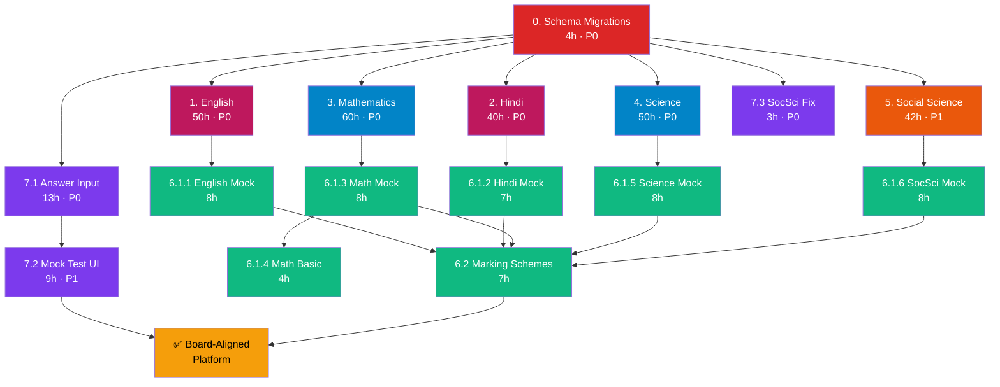

# Board Alignment Gap Closure — Implementation Plan

> **Created**: 2026-06-24
> **Source**: [CBSE_BOARD_ALIGNMENT_AUDIT.md](file:///home/sagarv/Projects/byAntiGravity/docs/CBSE_BOARD_ALIGNMENT_AUDIT.md), [Master_TODO.md](file:///home/sagarv/Projects/byAntiGravity/Master_TODO.md)
> **Status**: PLAN ONLY — do not execute without approval
> **Prerequisite**: Master_TODO Phases 1–3 (RLS, wired views, base chapter content) should be complete or well underway before this plan begins. This plan adds **board-exam format readiness** on top of the existing syllabus coverage work.

---

## Executive Summary

The [Board Alignment Audit](file:///home/sagarv/Projects/byAntiGravity/docs/CBSE_BOARD_ALIGNMENT_AUDIT.md) found that while chapter-level coverage is progressing (via Master_TODO Batches 3–4), the platform **does not yet prepare students for the actual exam format**. The five core subjects each have significant question-type, skill-format, and content gaps that will make a student who only uses this platform underprepared for their board paper.

This plan closes **every gap** identified in the audit across **7 work areas**.

| Work Area | Est. Hours | Priority |
|-----------|:---:|:---:|
| 1. English — Code 184 | 50h | P0 |
| 2. Hindi Course B — Code 085 | 40h | P0 |
| 3. Mathematics — Codes 041/241 | 60h | P0 |
| 4. Science — Code 086 | 50h | P0 |
| 5. Social Science — Code 087 | 40h | P1 |
| 6. Mock Papers | 50h | P1 |
| 7. Platform Changes | 25h | P0–P1 |
| **TOTAL** | **315h** | |

**Range estimate: 280–350 hours** depending on content complexity and review cycles.

---

## Table of Contents

1. [Schema Changes Required](#0-schema-changes-required)
2. [Gap Area 1: English — Code 184](#1-english--code-184)
3. [Gap Area 2: Hindi Course B — Code 085](#2-hindi-course-b--code-085)
4. [Gap Area 3: Mathematics — Codes 041/241](#3-mathematics--codes-041241)
5. [Gap Area 4: Science — Code 086](#4-science--code-086)
6. [Gap Area 5: Social Science — Code 087](#5-social-science--code-087)
7. [Gap Area 6: Mock Papers](#6-mock-papers)
8. [Gap Area 7: Platform Changes](#7-platform-changes)
9. [Dependency Graph](#8-dependency-graph)
10. [Sprint Plan (6 Weeks)](#9-sprint-plan-6-weeks)
11. [Risk Register](#10-risk-register)

---

## 0. Schema Changes Required

Before any gap-area content can be seeded, the database schema needs extensions. These are **blocking dependencies** for most tasks below.

### 0.1 Extend `question_type` ENUM

The current enum is `('multiple_choice', 'true_false', 'short_answer')`. Board papers require many more types.

**Migration** — `db/migrations/001_extend_question_types.sql`:

```sql
ALTER TYPE question_type ADD VALUE IF NOT EXISTS 'assertion_reason';
ALTER TYPE question_type ADD VALUE IF NOT EXISTS 'case_study';
ALTER TYPE question_type ADD VALUE IF NOT EXISTS 'extract_based';
ALTER TYPE question_type ADD VALUE IF NOT EXISTS 'diagram';
ALTER TYPE question_type ADD VALUE IF NOT EXISTS 'numerical';
ALTER TYPE question_type ADD VALUE IF NOT EXISTS 'proof';
ALTER TYPE question_type ADD VALUE IF NOT EXISTS 'map_based';
ALTER TYPE question_type ADD VALUE IF NOT EXISTS 'source_based';
ALTER TYPE question_type ADD VALUE IF NOT EXISTS 'image_interpretation';
ALTER TYPE question_type ADD VALUE IF NOT EXISTS 'give_reason';
ALTER TYPE question_type ADD VALUE IF NOT EXISTS 'long_answer';
ALTER TYPE question_type ADD VALUE IF NOT EXISTS 'letter_writing';
ALTER TYPE question_type ADD VALUE IF NOT EXISTS 'paragraph_writing';
ALTER TYPE question_type ADD VALUE IF NOT EXISTS 'grammar_fill';
ALTER TYPE question_type ADD VALUE IF NOT EXISTS 'editing_omission';
ALTER TYPE question_type ADD VALUE IF NOT EXISTS 'reading_comprehension';
ALTER TYPE question_type ADD VALUE IF NOT EXISTS 'story_completion';
```

| Est. | Priority | Deps | Deliverable |
|:---:|:---:|:---:|---|
| 1h | **P0** | None | `db/migrations/001_extend_question_types.sql` applied |

### 0.2 Add metadata columns to `quiz_questions`

```sql
ALTER TABLE quiz_questions ADD COLUMN IF NOT EXISTS marks INT NOT NULL DEFAULT 1;
-- marks already exists in schema ✅
ALTER TABLE quiz_questions ADD COLUMN IF NOT EXISTS explanation TEXT;
ALTER TABLE quiz_questions ADD COLUMN IF NOT EXISTS difficulty VARCHAR(20) DEFAULT 'standard';
-- 'basic' | 'standard' (for Math 041 vs 241 labelling)
ALTER TABLE quiz_questions ADD COLUMN IF NOT EXISTS source_year VARCHAR(20);
-- e.g. '2026-set1', '2025-sample', 'original'
ALTER TABLE quiz_questions ADD COLUMN IF NOT EXISTS topic VARCHAR(200);
-- granular topic within chapter
ALTER TABLE quiz_questions ADD COLUMN IF NOT EXISTS model_answer TEXT;
-- full model answer for descriptive questions
ALTER TABLE quiz_questions ADD COLUMN IF NOT EXISTS marking_scheme TEXT;
-- step-wise marks allocation
ALTER TABLE quiz_questions ADD COLUMN IF NOT EXISTS diagram_url VARCHAR(500);
-- URL to associated diagram image (if any)
```

| Est. | Priority | Deps | Deliverable |
|:---:|:---:|:---:|---|
| 2h | **P0** | 0.1 | `db/migrations/002_question_metadata.sql` applied |

### 0.3 Add English & Hindi subjects to `subjects` table

Currently only Mathematics, Science, and Social Science exist. Need to add two new subjects.

```sql
INSERT INTO subjects (name, code, description) VALUES
  ('English Language & Literature', 'ENG10', 'CBSE Class 10 English — Code 184'),
  ('Hindi Course B', 'HIN10', 'CBSE Class 10 Hindi — Code 085');
```

| Est. | Priority | Deps | Deliverable |
|:---:|:---:|:---:|---|
| 0.5h | **P0** | None | `db/migrations/003_add_english_hindi_subjects.sql` |

### 0.4 Add `assessment_scope` column to chapters

```sql
ALTER TABLE chapters ADD COLUMN IF NOT EXISTS assessment_scope VARCHAR(30) DEFAULT 'board_exam';
-- 'board_exam' | 'periodic_test' | 'project_only' | 'internal_assessment'
```

| Est. | Priority | Deps | Deliverable |
|:---:|:---:|:---:|---|
| 0.5h | **P1** | None | `db/migrations/004_chapter_scope.sql` |

> **Schema changes subtotal: 4h**

---

## 1. English — Code 184

> **Official paper: 80 marks — Reading (20) + Grammar & Writing (20) + Literature (40)**
> **Current state: Near-zero coverage. No subject entry, no chapters, no questions.**
> **Total estimate: 50 hours**

### 1.1 Reading Comprehension (20 marks)

| # | Task | What to Build | Source | Hours | Priority | Deps |
|---|------|---------------|--------|:---:|:---:|---|
| 1.1.1 | Unseen Passage Set A (Discursive) | 5 passages (300–350 words each) with 10 MCQs per passage. Topics: science, environment, education, society, technology. | Original composition + CBSE 2025–26 sample paper format | 6h | P0 | 0.3 |
| 1.1.2 | Unseen Passage Set B (Case-based Factual) | 5 passages (200–250 words with chart/table) with 10 MCQs per passage. Data interpretation focus. | Original composition modelling CBSE sample papers | 6h | P0 | 0.3 |
| 1.1.3 | Unseen Passage Set C (Practice Bank) | 5 additional passages (mix of discursive + factual) for extra practice | Original composition | 4h | P2 | 1.1.1, 1.1.2 |

### 1.2 Grammar Practice (Section B — Grammar)

| # | Task | What to Build | Source | Hours | Priority | Deps |
|---|------|---------------|--------|:---:|:---:|---|
| 1.2.1 | Tenses gap-fill exercises | 4 sets × 5 questions — simple/continuous/perfect in past/present/future | CBSE grammar syllabus, NCERT grammar exercises | 2h | P0 | 0.1 |
| 1.2.2 | Modals practice | 3 sets × 5 questions — should, could, would, may, might, must, need, dare | CBSE sample papers | 1.5h | P0 | 0.1 |
| 1.2.3 | Subject-verb agreement | 3 sets × 5 questions — tricky subjects (either/or, neither/nor, collective nouns) | CBSE grammar syllabus | 1.5h | P0 | 0.1 |
| 1.2.4 | Reported speech (direct → indirect) | 4 sets × 5 questions covering statements, questions, commands, requests | CBSE sample papers, NCERT textbook | 2h | P0 | 0.1 |
| 1.2.5 | Editing & omission exercises | 5 passages with deliberate errors (articles, prepositions, tenses, spelling) for editing; 5 passages with missing words for omission | CBSE 2025–26 sample paper format | 3h | P0 | 0.1 |

### 1.3 Writing Skills (Section B — Creative Writing)

| # | Task | What to Build | Source | Hours | Priority | Deps |
|---|------|---------------|--------|:---:|:---:|---|
| 1.3.1 | Formal letter writing | 5 prompts with model answers (complaint, enquiry, application, editor, official) + marking scheme | CBSE format guidelines, sample papers | 2h | P0 | 0.2 |
| 1.3.2 | Informal letter writing | 3 prompts with model answers (friend, relative, advice) | CBSE format guidelines | 1h | P1 | 0.2 |
| 1.3.3 | Analytical paragraph writing | 5 prompts (data interpretation from chart/graph/table/map) with model answers (100–120 words) | CBSE 2026 paper format | 2.5h | P0 | 0.2 |
| 1.3.4 | Story completion | 4 prompts with cue/beginning given, model completions (150–200 words) | CBSE writing section format | 1.5h | P1 | 0.2 |

### 1.4 Literature — Poetry Lessons

> These 6 poems are from First Flight (textbook) and are examined in the board paper. None currently exist on the platform.

| # | Task | What to Build | Source | Hours | Priority | Deps |
|---|------|---------------|--------|:---:|:---:|---|
| 1.4.1 | Dust of Snow (Robert Frost) | Chapter entry + V2 revision note (theme, literary devices, central idea) + 5 MCQs + 3 extract-based Qs + 2 short answer (40–50 words) | *First Flight* poetry section | 1.5h | P0 | 0.3 |
| 1.4.2 | The Ball Poem (John Berryman) | Same deliverables as above | *First Flight* | 1.5h | P0 | 0.3 |
| 1.4.3 | The Trees (Adrienne Rich) | Same deliverables | *First Flight* | 1.5h | P0 | 0.3 |
| 1.4.4 | For Anne Gregory (W.B. Yeats) | Same deliverables | *First Flight* | 1.5h | P0 | 0.3 |
| 1.4.5 | A Tiger in the Zoo (Leslie Norris) | Same deliverables | *First Flight* | 1.5h | P0 | 0.3 |
| 1.4.6 | The Tale of Custard the Dragon (Ogden Nash) | Same deliverables | *First Flight* | 1.5h | P0 | 0.3 |

### 1.5 Literature — Descriptive Answer Practice

| # | Task | What to Build | Source | Hours | Priority | Deps |
|---|------|---------------|--------|:---:|:---:|---|
| 1.5.1 | 40–50 word answer bank | 20 questions across all prose + poetry chapters with model answers + marking scheme | Board papers 2024–2026, sample papers | 3h | P0 | 1.4.x |
| 1.5.2 | 100–120 word answer bank | 10 analytical questions (character analysis, theme comparison, author's intent) with model answers | Board papers, NCERT exercises | 3h | P0 | 1.4.x |
| 1.5.3 | Extract-based prose questions | 15 extract-based question sets from First Flight prose chapters (3 per chapter for 5 prose chapters already covered or to be covered) | *First Flight* prose sections | 3h | P1 | 0.3 |

> **English subtotal: ~50 hours**

---

## 2. Hindi Course B — Code 085

> **Official paper: 80 marks — अपठित बोध (14) + व्यावहारिक व्याकरण (16) + पाठ्यपुस्तक (28) + रचनात्मक लेखन (22)**
> **Current state: Some literature chapters may exist under a Hindi subject, but grammar, writing, and comprehension are entirely missing.**
> **Total estimate: 40 hours**

### 2.1 अपठित बोध (Unseen Comprehension — 14 marks)

| # | Task | What to Build | Source | Hours | Priority | Deps |
|---|------|---------------|--------|:---:|:---:|---|
| 2.1.1 | गद्यांश (Prose passages) | 5 unseen Hindi passages (200–250 words) with 5 MCQs each. Topics: moral, social, educational, environmental | Original composition based on CBSE format | 5h | P0 | 0.3 |
| 2.1.2 | काव्यांश (Poetry passages) | 5 unseen Hindi poem extracts with 5 MCQs each — figurative language, mood, central idea | Original composition | 4h | P0 | 0.3 |

### 2.2 व्यावहारिक व्याकरण (Applied Grammar — 16 marks)

| # | Task | What to Build | Source | Hours | Priority | Deps |
|---|------|---------------|--------|:---:|:---:|---|
| 2.2.1 | पदबंध (Phrases) | 4 sets × 5 Qs — identify/classify संज्ञा/सर्वनाम/विशेषण/क्रिया पदबंध | CBSE Hindi B grammar syllabus | 2h | P0 | 0.1 |
| 2.2.2 | वाक्य रूपांतरण (Sentence transformation) | 4 sets × 5 Qs — active↔passive, direct↔indirect, affirmative↔negative, simple↔compound↔complex | CBSE Hindi B syllabus | 2h | P0 | 0.1 |
| 2.2.3 | समास (Compound words) | 3 sets × 5 Qs — identify समास type (तत्पुरुष, द्वन्द्व, कर्मधारय, बहुव्रीहि, अव्ययीभाव, द्विगु) + विग्रह | CBSE Hindi B syllabus | 2h | P0 | 0.1 |
| 2.2.4 | मुहावरे एवं लोकोक्तियाँ (Idioms & Proverbs) | Bank of 40 commonly examined मुहावरे with meaning + sentence usage; 4 practice sets × 5 Qs | CBSE Hindi B syllabus, previous year papers | 2h | P0 | 0.1 |

### 2.3 रचनात्मक लेखन (Creative Writing — 22 marks)

| # | Task | What to Build | Source | Hours | Priority | Deps |
|---|------|---------------|--------|:---:|:---:|---|
| 2.3.1 | अनुच्छेद लेखन (Paragraph writing) | 5 prompts (social issues, current events, moral values) with model answers (80–100 words) + marking scheme | CBSE format, sample papers | 2h | P0 | 0.2 |
| 2.3.2 | औपचारिक पत्र (Formal letter) | 5 prompts (प्रधानाचार्य, सम्पादक, अधिकारी) with model answers in correct format | CBSE format guidelines | 2h | P0 | 0.2 |
| 2.3.3 | अनौपचारिक पत्र (Informal letter) | 3 prompts (मित्र, परिवार) with model answers | CBSE format guidelines | 1h | P1 | 0.2 |
| 2.3.4 | विज्ञापन लेखन (Advertisement writing) | 4 prompts (product, event, lost & found, public awareness) with model visual layouts described | CBSE format | 1.5h | P0 | 0.2 |
| 2.3.5 | सूचना लेखन (Notice writing) | 4 prompts (school events, meetings, competitions) in proper notice format with model answers | CBSE format | 1.5h | P0 | 0.2 |

### 2.4 Literature Lessons (Textbook & Supplementary)

| # | Task | What to Build | Source | Hours | Priority | Deps |
|---|------|---------------|--------|:---:|:---:|---|
| 2.4.1 | Audit current Hindi chapters | Identify which prescribed पाठ/कविताएँ from *स्पर्श* and *संचयन* are already seeded vs missing | CBSE Hindi B syllabus 2025–26 | 1h | P0 | 0.3 |
| 2.4.2 | Seed missing prose chapters | Create chapter + V2 notes + 5 MCQs for each missing prescribed prose lesson from *स्पर्श* | *स्पर्श* textbook (need to extract or source) | 6h | P0 | 2.4.1 |
| 2.4.3 | Seed missing poetry chapters | Create chapter + V2 notes + 5 MCQs for each missing prescribed poem from *स्पर्श* | *स्पर्श* textbook | 4h | P0 | 2.4.1 |
| 2.4.4 | Extract-based poetry questions | 3 extract-based question sets per prescribed poem (stanza given → MCQs + short answer) | *स्पर्श* poetry sections | 3h | P0 | 2.4.3 |
| 2.4.5 | Supplementary reader questions | 5 long-answer questions per chapter from *संचयन* with model answers (100–120 words) | *संचयन* textbook | 2h | P1 | 2.4.1 |

> **Hindi subtotal: ~40 hours**

---

## 3. Mathematics — Codes 041/241

> **Official paper: 80 marks — 20 MCQs (1-mark) + 5 (2-mark) + 6 (3-mark) + 4 (5-mark) + 3 case studies (4-mark each)**
> **Current state: MCQs exist for ~10 chapters. Zero 2/3/5-mark questions. No proofs, no case studies, no graphical solutions.**
> **Total estimate: 60 hours**
>
> **Source files**: `mathematics_1.txt` through `mathematics_14.txt` in `/home/sagarv/Projects/cbse_class10_textbooks/extracted_text/`

### 3.1 Multi-Mark Question Banks

| # | Task | What to Build | Source | Hours | Priority | Deps |
|---|------|---------------|--------|:---:|:---:|---|
| 3.1.1 | 2-mark questions — all 14 chapters | 3 questions per chapter × 14 = 42 questions. Short-computation, single-concept application. Include model answer + marking scheme. | `mathematics_*.txt`, NCERT exercises, CBSE sample papers | 8h | P0 | 0.2 |
| 3.1.2 | 3-mark questions — all 14 chapters | 3 questions per chapter × 14 = 42 questions. Multi-step problems. Include step-wise marking. | Same sources | 10h | P0 | 0.2 |
| 3.1.3 | 5-mark questions — all 14 chapters | 2 questions per chapter × 14 = 28 questions. Multi-part long-answer. Include complete solution + marking scheme. | Same sources | 10h | P0 | 0.2 |

### 3.2 Proof Questions

| # | Task | What to Build | Source | Hours | Priority | Deps |
|---|------|---------------|--------|:---:|:---:|---|
| 3.2.1 | Real Numbers proofs | Irrationality of √2, √3, √5 proofs (3 variants). Fundamental Theorem of Arithmetic application. HCF×LCM proofs. | `mathematics_1.txt` | 3h | P0 | 0.2 |
| 3.2.2 | Geometry proofs — Triangles | BPT (Basic Proportionality Theorem) proof, converse of BPT, Pythagoras theorem proof, converse proof. | `mathematics_6.txt` | 3h | P0 | 0.2 |
| 3.2.3 | Geometry proofs — Circles | Tangent perpendicular to radius proof, tangent lengths from external point proof. | `mathematics_10.txt` | 2h | P0 | 0.2 |

### 3.3 Case-Study Based Questions

| # | Task | What to Build | Source | Hours | Priority | Deps |
|---|------|---------------|--------|:---:|:---:|---|
| 3.3.1 | Case studies — all 14 chapters | 3 case-study sets per chapter × 14 = 42 case studies. Each: real-world scenario + 4–5 sub-questions (MCQ + short answer). | CBSE sample papers 2024–2026, `mathematics_*.txt` chapter exercises | 14h | P0 | 0.1 |

### 3.4 Graphical Solutions

| # | Task | What to Build | Source | Hours | Priority | Deps |
|---|------|---------------|--------|:---:|:---:|---|
| 3.4.1 | Linear equations graphical method | 5 practice sets: plot two lines, identify intersection, label axes, classify (consistent/inconsistent/dependent). Include graph description or SVG. | `mathematics_3.txt` | 2h | P0 | 0.2 |
| 3.4.2 | Quadratic equations graphical method | 3 practice sets: sketch parabola, identify roots from graph. | `mathematics_4.txt` | 1.5h | P1 | 0.2 |
| 3.4.3 | Statistics graphical problems | Ogive construction, histogram → frequency polygon conversion, finding median from ogive. 5 problems. | `mathematics_13.txt` | 2h | P1 | 0.2 |

### 3.5 Difficulty Labelling

| # | Task | What to Build | Source | Hours | Priority | Deps |
|---|------|---------------|--------|:---:|:---:|---|
| 3.5.1 | Label all existing MCQs | Add `difficulty = 'basic'` or `'standard'` to every existing quiz question across all 14 Math chapters. Basic = Code 241, Standard = Code 041. | CBSE syllabus difficulty specifications | 2h | P1 | 0.2 |
| 3.5.2 | Label all new questions | Ensure all questions created in 3.1–3.4 have correct `difficulty` field | — | 2h | P1 | 3.1.x, 3.2.x, 3.3.x |

> **Mathematics subtotal: ~60 hours**

---

## 4. Science — Code 086

> **Official paper: 80 marks — 39 questions including MCQ, assertion-reason, diagrams, numericals, case-based, experiment-based**
> **Current state: MCQs exist for ~4 chapters. No diagram questions, no numericals, no assertion-reason, no case studies.**
> **Total estimate: 50 hours**
>
> **Source files**: `science_1.txt` through `science_13.txt` in `/home/sagarv/Projects/cbse_class10_textbooks/extracted_text/`

### 4.1 Diagram Practice

| # | Task | What to Build | Source | Hours | Priority | Deps |
|---|------|---------------|--------|:---:|:---:|---|
| 4.1.1 | Circuit diagrams (Physics) | 5 circuit diagram questions: draw circuit, identify components, calculate current/voltage. Include reference SVG/image for each. | `science_11.txt` (Electricity), `science_12.txt` (Magnetic Effects) | 4h | P0 | 0.1, 0.2 |
| 4.1.2 | Ray diagrams (Physics) | 8 ray diagram questions: concave/convex mirror, concave/convex lens, human eye defects. Step-wise marking for each diagram. | `science_9.txt` (Light), `science_10.txt` (Human Eye) | 4h | P0 | 0.1, 0.2 |
| 4.1.3 | Genetics crosses (Biology) | 5 Mendelian cross diagrams: monohybrid, dihybrid (if in syllabus), sex determination. Punnett square format. | `science_8.txt` (Heredity) | 3h | P0 | 0.1, 0.2 |
| 4.1.4 | Labelled figure questions (Biology) | 6 diagram-label questions: human digestive system, human heart, nephron, neuron, reproductive systems (male/female), plant reproductive parts. | `science_5.txt` (Life Processes), `science_6.txt` (Control & Coordination), `science_7.txt` (Reproduction) | 3h | P0 | 0.1, 0.2 |

### 4.2 Experiment/Observation Questions

| # | Task | What to Build | Source | Hours | Priority | Deps |
|---|------|---------------|--------|:---:|:---:|---|
| 4.2.1 | Chemistry activity-based Qs | 10 questions based on prescribed activities: pH testing, reactivity series, saponification, esterification, combustion tests. State observation → inference → conclusion. | `science_1.txt` through `science_4.txt` | 4h | P0 | 0.1, 0.2 |
| 4.2.2 | Physics experiment Qs | 8 questions based on prescribed practicals: Ohm's law, focal length of lens/mirror, current-voltage graph, Snell's law verification. | `science_9.txt`, `science_11.txt`, `science_12.txt` | 3h | P0 | 0.1, 0.2 |
| 4.2.3 | Biology experiment Qs | 6 questions: stomata observation, CO₂ evolution in respiration, starch test in leaves, budding/binary fission observation. | `science_5.txt`, `science_6.txt`, `science_7.txt` | 2h | P1 | 0.1, 0.2 |

### 4.3 Numericals (Physics + Chemistry)

| # | Task | What to Build | Source | Hours | Priority | Deps |
|---|------|---------------|--------|:---:|:---:|---|
| 4.3.1 | Electricity numericals | 8 problems: Ohm's law, resistance combinations (series/parallel), power/energy calculations, heating effect. Step-wise solution + marking. | `science_11.txt` | 3h | P0 | 0.2 |
| 4.3.2 | Light numericals | 6 problems: mirror formula, lens formula, magnification, power of lens, refractive index. | `science_9.txt`, `science_10.txt` | 2.5h | P0 | 0.2 |
| 4.3.3 | Chemistry numericals | 5 problems: balancing equations with mass calculation, percentage composition, mole concept (if in syllabus). | `science_1.txt`, `science_2.txt` | 2h | P1 | 0.2 |

### 4.4 'Give Reason' Answer Bank

| # | Task | What to Build | Source | Hours | Priority | Deps |
|---|------|---------------|--------|:---:|:---:|---|
| 4.4.1 | 'Give reason' questions — all 13 chapters | 3 per chapter × 13 = 39 questions. Format: statement → reason required (2–3 sentences). Model answers provided. | `science_*.txt`, board papers | 6h | P0 | 0.2 |

### 4.5 Case-Based & Assertion-Reason Questions

| # | Task | What to Build | Source | Hours | Priority | Deps |
|---|------|---------------|--------|:---:|:---:|---|
| 4.5.1 | Case-based integrated questions | 3 per chapter × 13 = 39 case studies. Each: real-world scenario integrating 2–3 concepts from the chapter, with 4–5 sub-questions (MCQ + descriptive). | `science_*.txt`, CBSE sample papers | 8h | P0 | 0.1 |
| 4.5.2 | Assertion-reason questions | 3 per chapter × 13 = 39 A-R questions. Format: Assertion + Reason → select correct option (both correct and R explains A / both correct but R doesn't explain A / A correct R wrong / A wrong R correct). | `science_*.txt`, CBSE sample papers | 5h | P0 | 0.1 |

> **Science subtotal: ~50 hours**

---

## 5. Social Science — Code 087

> **Official paper: 80 marks — 4 sections (History 20 + Geo 20 + Civics 20 + Eco 20) with MCQs, source-based, map, 2/3/5-mark questions**
> **Current state: 22 chapters seeded/in-progress. No map work, no source questions, no image interpretation, no structured long answers. Subject organisation fragmented.**
> **Total estimate: 40 hours**
>
> **Source files**: `social-history_*.txt`, `social-civics_*.txt`, `social-geography_*.txt`, `social-economics_*.txt` in `/home/sagarv/Projects/cbse_class10_textbooks/extracted_text/`

### 5.1 Map Practice (Dedicated Map Workbook)

| # | Task | What to Build | Source | Hours | Priority | Deps |
|---|------|---------------|--------|:---:|:---:|---|
| 5.1.1 | History map items | All prescribed map items: Surat, Champaran, Dandi, Jallianwala Bagh, Lahore, etc. Create question set with blank India map + answer key overlay. | CBSE History map work list, `social-history_*.txt` | 3h | P0 | 0.1 |
| 5.1.2 | Geography map items — India | All prescribed items: iron ore mines, coal mines, oil fields, thermal/nuclear power plants, major dams, textile industries, software technology parks, international airports, major seaports. Create question set. | CBSE Geography map work list, `social-geography_*.txt` | 5h | P0 | 0.1 |
| 5.1.3 | Map identification practice sets | 5 complete practice sets mixing History + Geography map items (as in the actual paper). Each set = 5 locations to mark on outline map. | Combined sources above | 2h | P1 | 5.1.1, 5.1.2 |

### 5.2 Cartoon/Image Interpretation

| # | Task | What to Build | Source | Hours | Priority | Deps |
|---|------|---------------|--------|:---:|:---:|---|
| 5.2.1 | Political cartoon questions | 8 cartoon/image description sets (Civics + History) with 3 interpretation MCQs per image. Describe cartoons from textbook or create analogous descriptions. | `social-civics_*.txt`, `social-history_*.txt`, CBSE sample papers | 3h | P1 | 0.1 |

### 5.3 Source/Case Extract Questions

| # | Task | What to Build | Source | Hours | Priority | Deps |
|---|------|---------------|--------|:---:|:---:|---|
| 5.3.1 | History source-based questions | 3 source extracts per chapter × 5 = 15 sets. Each: primary source excerpt + 3 comprehension MCQs. | `social-history_*.txt` (textbook extracts) | 4h | P0 | 0.1 |
| 5.3.2 | Civics case-based questions | 3 case scenarios per chapter × 5 = 15 sets. Each: real-world political scenario + 3–4 sub-questions. | `social-civics_*.txt`, CBSE sample papers | 3h | P0 | 0.1 |
| 5.3.3 | Economics data-interpretation Qs | 3 data sets per chapter × 5 = 15 sets. Each: table/graph + 3–4 analysis questions. | `social-economics_*.txt`, CBSE sample papers | 3h | P0 | 0.1 |
| 5.3.4 | Geography case-based questions | 2 case studies per chapter × 7 = 14 sets. | `social-geography_*.txt` | 3h | P1 | 0.1 |

### 5.4 Structured Model Answers (2/3/5-mark)

| # | Task | What to Build | Source | Hours | Priority | Deps |
|---|------|---------------|--------|:---:|:---:|---|
| 5.4.1 | 2-mark answers — all 22 chapters | 2 per chapter = 44 questions with model answers (30–40 words) + marking scheme | `social-*.txt`, board papers | 5h | P0 | 0.2 |
| 5.4.2 | 3-mark answers — all 22 chapters | 2 per chapter = 44 questions with model answers (60–80 words) + marking scheme | Same | 6h | P0 | 0.2 |
| 5.4.3 | 5-mark answers — all 22 chapters | 1 per chapter = 22 questions with model answers (120–150 words) + marking scheme | Same | 4h | P1 | 0.2 |

### 5.5 Chapter Scope Labels

| # | Task | What to Build | Source | Hours | Priority | Deps |
|---|------|---------------|--------|:---:|:---:|---|
| 5.5.1 | Label all 22 Social Science chapters | Set `assessment_scope` for each chapter: `board_exam`, `periodic_test`, or `project_only` based on official CBSE curriculum document. | CBSE 2025–26 curriculum PDF | 1h | P1 | 0.4 |

> **Social Science subtotal: ~42 hours** (rounded to ~40h in summary)

---

## 6. Mock Papers

> **Goal: One complete 80-mark mock paper per subject following the exact official CBSE format.**
> **Total estimate: 50 hours**
>
> **Prerequisite**: Gap areas 1–5 must be substantially complete so that the question bank is large enough to draw from.

### 6.1 Paper Generation

| # | Task | What to Build | Source | Hours | Priority | Deps |
|---|------|---------------|--------|:---:|:---:|---|
| 6.1.1 | English Mock Paper (Code 184) | Full 80-mark paper: Section A (Reading 20 marks — 2 passages), Section B (Grammar & Writing 20 marks — grammar Qs + letter + analytical para), Section C (Literature 40 marks — extracts, short, long answers). Include time allocation guide. | Gap Area 1 content + CBSE 2026 blueprint | 8h | P1 | 1.x substantially complete |
| 6.1.2 | Hindi Mock Paper (Code 085) | Full 80-mark paper: अपठित बोध (14) + व्याकरण (16) + पाठ्यपुस्तक (28) + लेखन (22). | Gap Area 2 content + CBSE 2026 blueprint | 7h | P1 | 2.x substantially complete |
| 6.1.3 | Mathematics Mock Paper (Code 041) | Full 80-mark paper: Section A (20 MCQs), Section B (5 × 2-mark), Section C (6 × 3-mark), Section D (4 × 5-mark), Section E (3 × case-study 4-mark). Internal choices where applicable. | Gap Area 3 content + CBSE 2026 blueprint | 8h | P1 | 3.x substantially complete |
| 6.1.4 | Mathematics Basic Mock (Code 241) | Parallel paper with `difficulty='basic'` questions only | Math question bank filtered | 4h | P2 | 6.1.3, 3.5.x |
| 6.1.5 | Science Mock Paper (Code 086) | Full 80-mark paper: Section A (16 MCQs), Section B (assertion-reason), Section C (short answers), Section D (long answers + diagram), Section E (case-based). | Gap Area 4 content + CBSE 2026 blueprint | 8h | P1 | 4.x substantially complete |
| 6.1.6 | Social Science Mock Paper (Code 087) | Full 80-mark paper: 4 equal sections (History/Geo/Civics/Eco × 20 marks). MCQs, source-based, short answers, long answers, map work. | Gap Area 5 content + CBSE 2026 blueprint | 8h | P1 | 5.x substantially complete |

### 6.2 Marking Schemes

| # | Task | What to Build | Source | Hours | Priority | Deps |
|---|------|---------------|--------|:---:|:---:|---|
| 6.2.1 | Marking scheme — all 6 papers | Step-wise marking scheme for every question in every mock paper. Format: question number → marks allocation → key points required → common deductions. | Model marking schemes from CBSE | 7h | P1 | 6.1.x |

> **Mock Papers subtotal: ~50 hours**

---

## 7. Platform Changes

> **Goal: The Flutter app must support the new content types.**
> **Total estimate: 25 hours**
>
> **Location**: `apps/mobile_web_client/lib/`

### 7.1 Answer Input Modes

| # | Task | What to Build | Source | Hours | Priority | Deps |
|---|------|---------------|--------|:---:|:---:|---|
| 7.1.1 | Text answer input widget | A `DescriptiveAnswerWidget` that shows a text area (expandable) for typing answers to 2/3/5-mark questions. Word count indicator. Submit → compare with model answer (revealed after submission). | New widget in `widgets/` | 4h | P0 | 0.2 |
| 7.1.2 | Diagram upload input | An `ImageUploadWidget` allowing students to take a photo or upload an image of their hand-drawn diagram. Store in Supabase Storage. For now, self-check only (show model diagram after upload). | New widget in `widgets/`, Supabase Storage bucket | 5h | P1 | 0.2 |
| 7.1.3 | Mixed-question quiz renderer | Extend `QuizView` to render different question types in sequence: MCQ, assertion-reason (4 fixed options), descriptive text box, diagram upload. Dispatch to correct widget based on `quiz_questions.type`. | Modify [QuizView](file:///home/sagarv/Projects/byAntiGravity/apps/mobile_web_client/lib/views) | 4h | P0 | 7.1.1, 7.1.2 |

### 7.2 Mock Test Features

| # | Task | What to Build | Source | Hours | Priority | Deps |
|---|------|---------------|--------|:---:|:---:|---|
| 7.2.1 | Exam timer | Countdown timer (configurable per quiz, default 3 hours for mock papers). Visual progress bar + time remaining. Auto-submit on expiry. Warning at 15 min and 5 min remaining. | Modify `QuizView` + `quizzes` table (`time_limit_seconds` column — already planned in Master_TODO 2.2.4) | 3h | P0 | Master_TODO 2.2.4 |
| 7.2.2 | Marking scheme reveal | After quiz submission, show a "View Marking Scheme" button. Display step-wise marks for each question from `quiz_questions.marking_scheme`. Collapsible per question. | Modify post-quiz results screen | 3h | P1 | 0.2 |
| 7.2.3 | Mock test dashboard | A new `MockTestView` or section in dashboard listing available mock papers per subject. Show: status (not attempted / in-progress / completed), score, time taken. | New view or widget | 3h | P1 | 6.1.x |

### 7.3 Social Science Organisation Fix

| # | Task | What to Build | Source | Hours | Priority | Deps |
|---|------|---------------|--------|:---:|:---:|---|
| 7.3.1 | Unify Social Science subject | If currently split as History/Civics/Geography/Economics subjects, merge into one "Social Science" subject with a `sub_discipline` tag on chapters. OR: create a unified view that groups the four sub-subjects under one Social Science card on the dashboard. | Decision required (see [full-syllabus-audit.md](file:///home/sagarv/Projects/byAntiGravity/docs/implementation-plans/full-syllabus-audit.md) decision #1) | 3h | P0 | Decision |

> **Platform Changes subtotal: ~25 hours**

---

## 8. Dependency Graph



### Key Dependencies

| Dependency | Blocks | Rationale |
|-----------|--------|-----------|
| **Schema migrations (0.x)** | ALL content tasks | New question types + metadata columns must exist before seeding |
| **English/Hindi subject creation (0.3)** | All English & Hindi tasks | Can't create chapters without a parent subject |
| **Answer input widgets (7.1)** | Mock test UI (7.2), descriptive question practice | Students can't answer descriptive Qs without text input |
| **Content areas 1–5** | Mock papers (6.x) | Need a question bank to compose papers from |
| **SocSci org decision** | SocSci content seeding + mock paper | Must know if it's 1 subject or 4 before structuring content |
| **Master_TODO Phase 1–2** | Everything here | RLS + wired views must work before board-alignment content matters |

---

## 9. Sprint Plan (6 Weeks)

> **Assumes**: 2 content developers working ~50h/week combined, plus 1 Flutter developer for platform changes.
> **Assumes**: Master_TODO Phases 1–3 are already underway in parallel.

### Sprint 1 — Foundation + English + Hindi Start (Week 1)

| Day | Content Dev 1 | Content Dev 2 | Flutter Dev | Hours |
|-----|---------------|---------------|-------------|:---:|
| 1 | Schema migrations (0.1–0.4) | English subject setup (0.3) + audit Hindi chapters (2.4.1) | Design `DescriptiveAnswerWidget` (7.1.1) | 8h |
| 2 | English reading comp Set A (1.1.1) | Hindi unseen prose passages (2.1.1) | Build `DescriptiveAnswerWidget` (7.1.1) | 10h |
| 3 | English reading comp Set B (1.1.2) | Hindi unseen poetry passages (2.1.2) | `ImageUploadWidget` design (7.1.2) | 10h |
| 4 | English grammar: tenses + modals (1.2.1, 1.2.2) | Hindi grammar: पदबंध + वाक्य रूपांतरण (2.2.1, 2.2.2) | `ImageUploadWidget` build (7.1.2) | 10h |
| 5 | English grammar: S-V agreement + reported speech (1.2.3, 1.2.4) | Hindi grammar: समास + मुहावरे (2.2.3, 2.2.4) | Mixed-question quiz renderer (7.1.3) | 10h |

**Sprint 1 total: ~48h**

### Sprint 2 — English Completion + Hindi Writing (Week 2)

| Day | Content Dev 1 | Content Dev 2 | Flutter Dev | Hours |
|-----|---------------|---------------|-------------|:---:|
| 1 | English editing/omission (1.2.5) | Hindi अनुच्छेद + पत्र (2.3.1, 2.3.2) | Finish mixed-question renderer (7.1.3) | 10h |
| 2 | English formal/informal letters (1.3.1, 1.3.2) | Hindi विज्ञापन + सूचना (2.3.4, 2.3.5) | Exam timer (7.2.1) | 10h |
| 3 | English analytical para + story (1.3.3, 1.3.4) | Hindi informal letter (2.3.3) + start literature seeding (2.4.2) | Exam timer polish + testing | 8h |
| 4 | Poetry: Dust of Snow + Ball Poem (1.4.1, 1.4.2) | Hindi prose seeding continued (2.4.2) | Marking scheme reveal (7.2.2) | 10h |
| 5 | Poetry: The Trees + For Anne Gregory (1.4.3, 1.4.4) | Hindi poetry seeding (2.4.3) | SocSci org fix (7.3.1) | 10h |

**Sprint 2 total: ~48h**

### Sprint 3 — English/Hindi Finish + Mathematics Start (Week 3)

| Day | Content Dev 1 | Content Dev 2 | Flutter Dev | Hours |
|-----|---------------|---------------|-------------|:---:|
| 1 | Poetry: Tiger in Zoo + Custard (1.4.5, 1.4.6) | Hindi extract-based poetry Qs (2.4.4) | Mock test dashboard (7.2.3) | 10h |
| 2 | English 40-50 word answer bank (1.5.1) | Hindi supplementary reader Qs (2.4.5) | Flutter testing + bug fixes | 8h |
| 3 | English 100-120 word answer bank (1.5.2) | Math 2-mark questions start (3.1.1) | — (platform changes done) | 8h |
| 4 | English extract-based prose Qs (1.5.3) | Math 2-mark continued (3.1.1) | — | 8h |
| 5 | Math 3-mark questions start (3.1.2) | Math proofs: Real Numbers (3.2.1) | — | 8h |

**Sprint 3 total: ~42h**

### Sprint 4 — Mathematics + Science (Week 4)

| Day | Content Dev 1 | Content Dev 2 | Flutter Dev | Hours |
|-----|---------------|---------------|-------------|:---:|
| 1 | Math 3-mark continued (3.1.2) | Math proofs: Triangles (3.2.2) | — | 8h |
| 2 | Math 5-mark questions (3.1.3) | Math proofs: Circles (3.2.3) | — | 8h |
| 3 | Math 5-mark continued (3.1.3) | Math case studies start (3.3.1) | — | 8h |
| 4 | Math graphical solutions (3.4.1–3.4.3) | Math case studies continued (3.3.1) | — | 8h |
| 5 | Math difficulty labelling (3.5.1, 3.5.2) | Science circuit diagrams (4.1.1) | — | 8h |

**Sprint 4 total: ~40h**

### Sprint 5 — Science + Social Science (Week 5)

| Day | Content Dev 1 | Content Dev 2 | Flutter Dev | Hours |
|-----|---------------|---------------|-------------|:---:|
| 1 | Science ray diagrams (4.1.2) | Science genetics crosses (4.1.3) | — | 8h |
| 2 | Science labelled figures (4.1.4) | Science chemistry activities (4.2.1) | — | 8h |
| 3 | Science physics experiments (4.2.2) | Science electricity numericals (4.3.1) | — | 8h |
| 4 | Science bio experiments (4.2.3) + light numericals (4.3.2) | Science chem numericals (4.3.3) + give reason bank (4.4.1 start) | — | 10h |
| 5 | Science give reason continued (4.4.1) | Science case-based Qs (4.5.1 start) | — | 8h |

**Sprint 5 total: ~42h**

### Sprint 6 — Science Finish + Social Science + Mock Papers (Week 6)

| Day | Content Dev 1 | Content Dev 2 | Flutter Dev | Hours |
|-----|---------------|---------------|-------------|:---:|
| 1 | Science case-based continued (4.5.1) | Science assertion-reason (4.5.2) | — | 8h |
| 2 | SocSci map practice (5.1.1, 5.1.2) | SocSci source-based: History (5.3.1) | — | 8h |
| 3 | SocSci map practice sets (5.1.3) + cartoons (5.2.1) | SocSci case-based: Civics + Economics (5.3.2, 5.3.3) | — | 8h |
| 4 | SocSci 2-mark + 3-mark answers (5.4.1, 5.4.2) | SocSci Geography cases (5.3.4) + 5-mark answers (5.4.3) | — | 10h |
| 5 | SocSci chapter scope labels (5.5.1) + Start English Mock (6.1.1) | Start Math Mock (6.1.3) | — | 8h |

**Sprint 6 total: ~42h**

### Overflow / Sprint 7 — Mock Papers Completion (Week 7, if needed)

| Day | Content Dev 1 | Content Dev 2 | Hours |
|-----|---------------|---------------|:---:|
| 1 | Finish English Mock (6.1.1) | Finish Math Mock (6.1.3) | 8h |
| 2 | Hindi Mock (6.1.2) | Science Mock (6.1.5) | 8h |
| 3 | Hindi Mock finish | SocSci Mock (6.1.6) | 8h |
| 4 | Math Basic Mock (6.1.4) | SocSci Mock finish | 8h |
| 5 | Marking schemes (6.2.1) | Marking schemes (6.2.1) | 8h |

**Sprint 7 total: ~40h**

### Sprint Summary

| Sprint | Week | Focus | Hours |
|:---:|:---:|-------|:---:|
| 1 | 1 | Schema + English/Hindi start + Platform widgets | ~48h |
| 2 | 2 | English/Hindi complete + Timer/Marking UI | ~48h |
| 3 | 3 | English/Hindi finish + Math start + Mock dashboard | ~42h |
| 4 | 4 | Mathematics complete | ~40h |
| 5 | 5 | Science complete | ~42h |
| 6 | 6 | Social Science + Mock papers start | ~42h |
| 7 (overflow) | 7 | Mock papers + marking schemes | ~40h |
| **TOTAL** | **6–7 weeks** | | **~302h** |

---

## 10. Risk Register

| Risk | Impact | Probability | Mitigation |
|------|:---:|:---:|-----------|
| **Hindi/English textbook PDFs not yet extracted** | High — blocks all language content | Medium | Source *First Flight*, *Footprints Without Feet*, *स्पर्श*, *संचयन* PDFs immediately. Extract text before Sprint 1. |
| **Diagram questions need actual images** | Medium — text-only diagrams are weaker | High | Use SVG/ASCII diagrams initially. Generate proper images with `generate_image` tool or commission. |
| **Map practice needs blank outline maps** | Medium — maps are essential for SocSci | High | Source royalty-free outline maps of India and world from NCERT atlas or Wikimedia. |
| **Schema migration breaks existing data** | High — could corrupt production | Low | Run migrations on staging first. Use `IF NOT EXISTS` guards. |
| **Hindi content quality** | Medium — Hindi content is harder to auto-generate | Medium | Have a Hindi-fluent reviewer validate all Hindi content before seeding. |
| **Mock paper format changes** | Medium — CBSE may update format for 2026–27 | Low | Build papers from modular question bank, not hardcoded. Easy to regenerate. |
| **Master_TODO phases delayed** | High — this plan assumes Phase 1–3 progress | Medium | Platform changes (Area 7) can proceed independently. Content seeding can be done in SQL files ready to apply. |

---

## Grand Total

| Area | Low Est. | High Est. | Target |
|------|:---:|:---:|:---:|
| 0. Schema | 3h | 5h | **4h** |
| 1. English | 40h | 60h | **50h** |
| 2. Hindi | 30h | 50h | **40h** |
| 3. Mathematics | 50h | 70h | **60h** |
| 4. Science | 40h | 60h | **50h** |
| 5. Social Science | 30h | 50h | **42h** |
| 6. Mock Papers | 40h | 60h | **50h** |
| 7. Platform | 20h | 30h | **25h** |
| **TOTAL** | **253h** | **385h** | **~321h** |

**Recommended range: 280–350 hours**
**Timeline: 6–7 weeks** with 2 content developers + 1 Flutter developer

> [!IMPORTANT]
> **Open decisions before execution:**
> 1. Source English textbooks (*First Flight*, *Footprints Without Feet*) — extract text files like the existing Math/Science/SocSci set?
> 2. Source Hindi textbooks (*स्पर्श*, *संचयन*) — same extraction pipeline?
> 3. Social Science: merge into 1 subject or keep as 4? (Blocks 5.x and 7.3.1)
> 4. Diagram format: SVG files in Supabase Storage, or text-described diagrams initially?
> 5. Should mock papers be stored as special `quizzes` rows or as a separate `mock_papers` table?
> 6. Math: support both Standard (041) and Basic (241) from day 1, or Standard-first?
