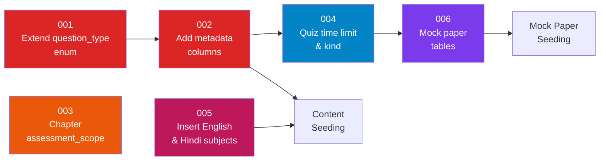

# Schema Migrations for Board-Paper Format Support

> **Created**: 2026-06-24
> **Status**: PLAN ONLY — do not execute without approval
> **Depends on**: [board-alignment-gap-closure.md](file:///home/sagarv/Projects/byAntiGravity/docs/implementation-plans/board-alignment-gap-closure.md) §0
> **Affected files**:
> - [schema.sql](file:///home/sagarv/Projects/byAntiGravity/db/schema.sql) (source of truth)
> - [models.dart](file:///home/sagarv/Projects/byAntiGravity/apps/mobile_web_client/lib/models.dart) (Flutter data models)
> - [seed.sql](file:///home/sagarv/Projects/byAntiGravity/db/seed.sql) (new subject inserts)

---

## Table of Contents

1. [Current State Audit](#1-current-state-audit)
2. [Migration 001 — Extend `question_type` Enum](#2-migration-001--extend-question_type-enum)
3. [Migration 002 — Add Metadata Columns to `quiz_questions`](#3-migration-002--add-metadata-columns-to-quiz_questions)
4. [Migration 003 — Add `assessment_scope` to `chapters`](#4-migration-003--add-assessment_scope-to-chapters)
5. [Migration 004 — Add `time_limit_seconds` to `quizzes`](#5-migration-004--add-time_limit_seconds-to-quizzes)
6. [Migration 005 — Insert English & Hindi Subjects](#6-migration-005--insert-english--hindi-subjects)
7. [Migration 006 — Create `mock_papers` and `mock_paper_questions`](#7-migration-006--create-mock_papers-and-mock_paper_questions)
8. [What Stays Unchanged](#8-what-stays-unchanged)
9. [Flutter Model Updates](#9-flutter-model-updates)
10. [Migration Order & Dependencies](#10-migration-order--dependencies)
11. [Rollback Strategy](#11-rollback-strategy)
12. [Open Questions](#12-open-questions)

---

## 1. Current State Audit

### Database (from [schema.sql](file:///home/sagarv/Projects/byAntiGravity/db/schema.sql))

| Table | Relevant Columns | Gap |
|-------|-------------------|-----|
| `subjects` | `id, name, code, description, thumbnail_url` | Only 3 subjects: Math, Science, SocSci. Missing English (184) and Hindi B (085). |
| `chapters` | `id, subject_id, title, sequence_number, description` | No `assessment_scope` column (board_exam / periodic_test / project_only). |
| `quizzes` | `id, chapter_id, title, passing_percentage` | No `time_limit_seconds` for timed mock exams. |
| `quiz_questions` | `id, quiz_id, question_text, type, options, correct_option_index, correct_answer_text, marks` | `type` enum only has `multiple_choice`, `true_false`, `short_answer`. No metadata for difficulty, source year, model answer, marking scheme, or diagram. |
| `quiz_attempts` | `id, user_id, quiz_id, score_percentage, passed, attempted_at` | Adequate — no changes needed. |

### Flutter Models (from [models.dart](file:///home/sagarv/Projects/byAntiGravity/apps/mobile_web_client/lib/models.dart))

| Model | Gap |
|-------|-----|
| `QuizQuestion` (L55-65) | Only has `questionText`, `options`, `correctAnswerIndex`. No `type`, `marks`, `modelAnswer`, `markingScheme`, `difficulty`, `diagramUrl`, or sub-questions support. |
| `Quiz` (L67-81) | Missing `timeLimitSeconds`, `totalMarks`. Has `duration` as String but no structured time limit. |
| `Chapter` (L27-35) | Missing `id`, `assessmentScope`. |
| `Subject` (L37-53) | Missing `code`. |

---

## 2. Migration 001 — Extend `question_type` Enum

**File**: `db/migrations/001_extend_question_types.sql`

> [!IMPORTANT]
> In PostgreSQL, `ALTER TYPE ... ADD VALUE` cannot run inside a transaction block. Each statement must be committed individually. Supabase SQL Editor handles this automatically, but if running via `psql`, use `\set ON_ERROR_STOP on` and avoid wrapping in `BEGIN/COMMIT`.

```sql
-- Migration 001: Extend question_type enum for board-paper formats
-- Existing values: 'multiple_choice', 'true_false', 'short_answer'
-- NOTE: ADD VALUE IF NOT EXISTS requires PostgreSQL 9.3+ (we target 14+)

ALTER TYPE question_type ADD VALUE IF NOT EXISTS 'assertion_reason';
ALTER TYPE question_type ADD VALUE IF NOT EXISTS 'short_answer_2mark';
ALTER TYPE question_type ADD VALUE IF NOT EXISTS 'short_answer_3mark';
ALTER TYPE question_type ADD VALUE IF NOT EXISTS 'long_answer_5mark';
ALTER TYPE question_type ADD VALUE IF NOT EXISTS 'case_study';
ALTER TYPE question_type ADD VALUE IF NOT EXISTS 'diagram_label';
ALTER TYPE question_type ADD VALUE IF NOT EXISTS 'map_marking';
ALTER TYPE question_type ADD VALUE IF NOT EXISTS 'source_based';
ALTER TYPE question_type ADD VALUE IF NOT EXISTS 'numerical';
ALTER TYPE question_type ADD VALUE IF NOT EXISTS 'proof';
ALTER TYPE question_type ADD VALUE IF NOT EXISTS 'give_reason';
ALTER TYPE question_type ADD VALUE IF NOT EXISTS 'long_answer';
ALTER TYPE question_type ADD VALUE IF NOT EXISTS 'letter_writing';
ALTER TYPE question_type ADD VALUE IF NOT EXISTS 'paragraph_writing';
ALTER TYPE question_type ADD VALUE IF NOT EXISTS 'grammar_fill';
ALTER TYPE question_type ADD VALUE IF NOT EXISTS 'editing_omission';
ALTER TYPE question_type ADD VALUE IF NOT EXISTS 'reading_comprehension';
ALTER TYPE question_type ADD VALUE IF NOT EXISTS 'story_completion';
ALTER TYPE question_type ADD VALUE IF NOT EXISTS 'image_interpretation';
ALTER TYPE question_type ADD VALUE IF NOT EXISTS 'extract_based';
```

### Mapping: Question Types → Subjects

| Enum Value | Board Format | Subjects | Marks |
|-----------|-------------|----------|:---:|
| `multiple_choice` *(existing)* | MCQ (A/B/C/D) | All | 1 |
| `true_false` *(existing)* | True/False | All | 1 |
| `short_answer` *(existing)* | Generic short answer | All | 1–2 |
| `assertion_reason` | Assertion + Reason → select relationship | Science, SocSci | 1 |
| `short_answer_2mark` | 2-mark descriptive (30–40 words) | Math, Science, SocSci | 2 |
| `short_answer_3mark` | 3-mark descriptive (60–80 words) | Math, Science, SocSci | 3 |
| `long_answer_5mark` | 5-mark descriptive (120–150 words) | Math, Science, SocSci | 5 |
| `case_study` | Passage + 3–5 sub-questions | Math, Science, SocSci | 4 |
| `diagram_label` | Image + labels to fill | Science | 2–5 |
| `map_marking` | Map + locations to mark | SocSci (History + Geography) | 2–5 |
| `source_based` | Text/image extract + questions | SocSci (History) | 4 |
| `numerical` | Computation with expected answer + unit | Science (Physics, Chem), Math | 2–5 |
| `proof` | Mathematical/logical proof | Math | 3–5 |
| `give_reason` | Statement → explain why | Science | 2–3 |
| `long_answer` | Generic long-form (for Hindi literature) | Hindi, English | 5 |
| `letter_writing` | Formal/informal letter format | English, Hindi | 5 |
| `paragraph_writing` | Analytical paragraph / अनुच्छेद | English, Hindi | 5 |
| `grammar_fill` | Gap-fill grammar exercise | English, Hindi | 1 |
| `editing_omission` | Find errors / missing words | English | 1 |
| `reading_comprehension` | Unseen passage + MCQs | English, Hindi | 1 |
| `story_completion` | Given beginning → complete story | English | 5 |
| `image_interpretation` | Cartoon/photo → interpret | SocSci | 1 |
| `extract_based` | Literature extract + questions | English, Hindi | 1–4 |

> [!NOTE]
> We keep `short_answer_2mark` and `short_answer_3mark` as distinct types (not just `short_answer` with varying marks) because the UI renderer needs to show different word-limit hints and marking rubrics per type. The `marks` column provides the numerical value; the type drives the UI template.

---

## 3. Migration 002 — Add Metadata Columns to `quiz_questions`

**File**: `db/migrations/002_question_metadata.sql`

```sql
-- Migration 002: Add board-paper metadata to quiz_questions
-- All columns use IF NOT EXISTS / defaults to be safely re-runnable

-- marks column already exists (INT NOT NULL DEFAULT 1) ✅

-- Explanation text (shown after answering — for all question types)
ALTER TABLE quiz_questions
  ADD COLUMN IF NOT EXISTS explanation TEXT;

-- Difficulty tier: maps to CBSE basic (Code 241) vs standard (Code 041)
-- Values: 'easy', 'medium', 'hard' (for general use)
-- Also: 'basic', 'standard' (for Math 041 vs 241 distinction)
ALTER TABLE quiz_questions
  ADD COLUMN IF NOT EXISTS difficulty VARCHAR(20) DEFAULT 'medium';

-- CBSE board code: '041' (Math Standard), '241' (Math Basic),
-- '086' (Science), '087' (SocSci), '184' (English), '085' (Hindi B)
ALTER TABLE quiz_questions
  ADD COLUMN IF NOT EXISTS board_code VARCHAR(10);

-- Source year: '2026-set1', '2025-sample', '2024-compartment', 'original'
ALTER TABLE quiz_questions
  ADD COLUMN IF NOT EXISTS source_year VARCHAR(30);

-- Granular topic within chapter (e.g., "Ohm's Law", "BPT Proof")
ALTER TABLE quiz_questions
  ADD COLUMN IF NOT EXISTS topic VARCHAR(200);

-- Full model answer for descriptive / non-MCQ questions
-- For MCQ: NULL (correct_option_index suffices)
-- For descriptive: complete expected answer text
ALTER TABLE quiz_questions
  ADD COLUMN IF NOT EXISTS model_answer TEXT;

-- Step-wise marking scheme (e.g., "1 mark: formula, 1 mark: substitution, 1 mark: answer")
-- Stored as plain text with line breaks, not JSONB, for easy display
ALTER TABLE quiz_questions
  ADD COLUMN IF NOT EXISTS marking_scheme TEXT;

-- URL to associated diagram/image (for diagram_label, map_marking, image_interpretation)
-- Points to Supabase Storage or external CDN
ALTER TABLE quiz_questions
  ADD COLUMN IF NOT EXISTS diagram_url VARCHAR(500);

-- Parent question ID — for case_study sub-questions
-- A case_study parent row holds the passage; children hold individual sub-Qs
-- NULL for standalone questions, points to parent quiz_question.id for sub-questions
ALTER TABLE quiz_questions
  ADD COLUMN IF NOT EXISTS parent_question_id UUID REFERENCES quiz_questions(id) ON DELETE CASCADE;

-- Sequence within a case study or source-based parent (sub-question ordering)
ALTER TABLE quiz_questions
  ADD COLUMN IF NOT EXISTS sub_question_sequence INT;

-- Expected numerical answer (for 'numerical' type) — e.g., 4.5
ALTER TABLE quiz_questions
  ADD COLUMN IF NOT EXISTS expected_numerical_answer DECIMAL;

-- Unit for numerical answer — e.g., 'Ω', 'A', 'cm', 'dioptre'
ALTER TABLE quiz_questions
  ADD COLUMN IF NOT EXISTS expected_unit VARCHAR(30);

-- Index for sub-question ordering within case studies
CREATE INDEX IF NOT EXISTS idx_quiz_questions_parent
  ON quiz_questions(parent_question_id);
```

### Column Purpose Matrix

| Column | MCQ | Assertion-Reason | Short 2/3 | Long 5 | Case Study Parent | Case Study Child | Diagram | Numerical | Proof |
|--------|:---:|:---:|:---:|:---:|:---:|:---:|:---:|:---:|:---:|
| `question_text` | ✅ | ✅ (Assertion) | ✅ | ✅ | ✅ (passage) | ✅ | ✅ (instructions) | ✅ | ✅ |
| `options` | ✅ | ✅ (4 fixed) | ❌ | ❌ | ❌ | maybe | ❌ | ❌ | ❌ |
| `correct_option_index` | ✅ | ✅ | ❌ | ❌ | ❌ | maybe | ❌ | ❌ | ❌ |
| `model_answer` | ❌ | ❌ | ✅ | ✅ | ❌ | ✅ | ✅ | ✅ | ✅ |
| `marking_scheme` | ❌ | ❌ | ✅ | ✅ | ❌ | ✅ | ✅ | ✅ | ✅ |
| `diagram_url` | ❌ | ❌ | ❌ | ❌ | ❌ | ❌ | ✅ | ❌ | ❌ |
| `parent_question_id` | ❌ | ❌ | ❌ | ❌ | ❌ | ✅ | ❌ | ❌ | ❌ |
| `expected_numerical_answer` | ❌ | ❌ | ❌ | ❌ | ❌ | ❌ | ❌ | ✅ | ❌ |
| `expected_unit` | ❌ | ❌ | ❌ | ❌ | ❌ | ❌ | ❌ | ✅ | ❌ |

### Assertion-Reason Storage Convention

The `options` JSONB for `assertion_reason` type will always store the 4 standard CBSE options:

```json
[
  "Both A and R are true, and R is the correct explanation of A",
  "Both A and R are true, but R is NOT the correct explanation of A",
  "A is true but R is false",
  "A is false but R is true"
]
```

The `question_text` stores both statements:

```
Assertion (A): <statement>\nReason (R): <statement>
```

---

## 4. Migration 003 — Add `assessment_scope` to `chapters`

**File**: `db/migrations/003_chapter_assessment_scope.sql`

```sql
-- Migration 003: Tag chapters by assessment scope
-- Allows filtering chapters by: board_exam, periodic_test, project_only, internal_assessment

ALTER TABLE chapters
  ADD COLUMN IF NOT EXISTS assessment_scope VARCHAR(30) NOT NULL DEFAULT 'board_exam';

-- COMMENT: Values are not an enum because CBSE changes them; VARCHAR is more flexible.
-- Expected values: 'board_exam' | 'periodic_test' | 'project_only' | 'internal_assessment'
```

---

## 5. Migration 004 — Add `time_limit_seconds` to `quizzes`

**File**: `db/migrations/004_quiz_time_limit.sql`

```sql
-- Migration 004: Add timed exam support to quizzes
-- Default NULL = untimed (chapter quizzes). Set for mock papers.

ALTER TABLE quizzes
  ADD COLUMN IF NOT EXISTS time_limit_seconds INT;

-- Also add total_marks for mock paper validation
ALTER TABLE quizzes
  ADD COLUMN IF NOT EXISTS total_marks INT;

-- Add a quiz_kind to distinguish chapter quizzes from mock papers
-- 'chapter_quiz' = existing behavior, 'mock_paper' = full 80-mark timed exam
ALTER TABLE quizzes
  ADD COLUMN IF NOT EXISTS quiz_kind VARCHAR(20) NOT NULL DEFAULT 'chapter_quiz';

-- Board code for mock papers: '041', '241', '086', '087', '184', '085'
ALTER TABLE quizzes
  ADD COLUMN IF NOT EXISTS board_code VARCHAR(10);
```

---

## 6. Migration 005 — Insert English & Hindi Subjects

**File**: `db/migrations/005_add_english_hindi_subjects.sql`

```sql
-- Migration 005: Add English and Hindi B subjects
-- Uses deterministic UUIDs for referential consistency across environments

INSERT INTO subjects (id, name, code, description, thumbnail_url) VALUES
  (
    'a0eebc99-9c0b-4ef8-bb6d-6bb9bd380a44',
    'English Language & Literature',
    'ENG10',
    'Reading Comprehension, Grammar, Creative Writing & Literature — Code 184',
    'https://images.unsplash.com/photo-1457369804613-52c61a468e7d?w=500&auto=format&fit=crop&q=60'
  ),
  (
    'a0eebc99-9c0b-4ef8-bb6d-6bb9bd380a55',
    'Hindi Course B',
    'HIN10',
    'अपठित बोध, व्यावहारिक व्याकरण, पाठ्यपुस्तक एवं रचनात्मक लेखन — Code 085',
    'https://images.unsplash.com/photo-1524995997946-a1c2e315a42f?w=500&auto=format&fit=crop&q=60'
  )
ON CONFLICT (code) DO NOTHING;
```

> [!NOTE]
> The UUIDs follow the existing pattern from [seed.sql](file:///home/sagarv/Projects/byAntiGravity/db/seed.sql) (line 16–18): `a0eebc99-9c0b-4ef8-bb6d-6bb9bd380aXX` where XX is `44` for English and `55` for Hindi.

---

## 7. Migration 006 — Create `mock_papers` and `mock_paper_questions`

**File**: `db/migrations/006_mock_papers.sql`

> [!IMPORTANT]
> **Design decision**: Mock papers get their own table rather than reusing `quizzes` with `quiz_kind = 'mock_paper'`. Rationale: mock papers have unique structure (sections, strict mark totals, internal choices) that would pollute the quizzes table. The `quizzes` table stays lean for chapter-level practice. Mock papers link to questions from the same `quiz_questions` pool via a join table.
>
> **Alternative considered**: Using `quizzes` with `quiz_kind = 'mock_paper'` + auto-generated section grouping. This is simpler but loses section-level metadata (section name, section-total marks, internal choice rules). We chose the dedicated table approach.

```sql
-- Migration 006: Mock paper structure tables

-- A mock paper represents a full 80-mark CBSE board exam simulation
CREATE TABLE mock_papers (
    id UUID PRIMARY KEY DEFAULT uuid_generate_v4(),
    subject_id UUID NOT NULL REFERENCES subjects(id) ON DELETE CASCADE,
    title VARCHAR(200) NOT NULL,                  -- e.g., "Mathematics Standard Mock Paper 1"
    board_code VARCHAR(10) NOT NULL,              -- '041', '241', '086', '087', '184', '085'
    total_marks INT NOT NULL DEFAULT 80,
    time_limit_seconds INT NOT NULL DEFAULT 10800, -- 3 hours = 10800s
    year VARCHAR(10),                              -- '2026', '2025-sample'
    description TEXT,
    is_published BOOLEAN NOT NULL DEFAULT FALSE,
    created_at TIMESTAMP WITH TIME ZONE DEFAULT CURRENT_TIMESTAMP,
    updated_at TIMESTAMP WITH TIME ZONE DEFAULT CURRENT_TIMESTAMP
);

-- Sections within a mock paper (e.g., "Section A — MCQs", "Section B — 2-mark")
CREATE TABLE mock_paper_sections (
    id UUID PRIMARY KEY DEFAULT uuid_generate_v4(),
    mock_paper_id UUID NOT NULL REFERENCES mock_papers(id) ON DELETE CASCADE,
    title VARCHAR(100) NOT NULL,                   -- e.g., "Section A"
    description TEXT,                               -- e.g., "All questions are compulsory (1 mark each)"
    sequence_number INT NOT NULL,
    section_total_marks INT NOT NULL,
    has_internal_choice BOOLEAN NOT NULL DEFAULT FALSE,
    UNIQUE(mock_paper_id, sequence_number)
);

-- Join table: links quiz_questions into mock paper sections with ordering
CREATE TABLE mock_paper_questions (
    id UUID PRIMARY KEY DEFAULT uuid_generate_v4(),
    section_id UUID NOT NULL REFERENCES mock_paper_sections(id) ON DELETE CASCADE,
    question_id UUID NOT NULL REFERENCES quiz_questions(id) ON DELETE CASCADE,
    sequence_number INT NOT NULL,                   -- Question number within section
    is_choice_for UUID REFERENCES mock_paper_questions(id), -- Internal choice: points to the question this is an alternative for
    UNIQUE(section_id, sequence_number, is_choice_for)
);

-- User attempts on mock papers (separate from quiz_attempts for richer metadata)
CREATE TABLE mock_paper_attempts (
    id UUID PRIMARY KEY DEFAULT uuid_generate_v4(),
    user_id UUID NOT NULL REFERENCES users(id) ON DELETE CASCADE,
    mock_paper_id UUID NOT NULL REFERENCES mock_papers(id) ON DELETE CASCADE,
    total_score INT,                                -- Out of total_marks
    time_taken_seconds INT,                         -- Actual time used
    status VARCHAR(20) NOT NULL DEFAULT 'in_progress', -- 'in_progress', 'submitted', 'timed_out'
    started_at TIMESTAMP WITH TIME ZONE DEFAULT CURRENT_TIMESTAMP,
    submitted_at TIMESTAMP WITH TIME ZONE
);

-- Individual answers within a mock paper attempt
CREATE TABLE mock_paper_answers (
    id UUID PRIMARY KEY DEFAULT uuid_generate_v4(),
    attempt_id UUID NOT NULL REFERENCES mock_paper_attempts(id) ON DELETE CASCADE,
    question_id UUID NOT NULL REFERENCES quiz_questions(id) ON DELETE CASCADE,
    selected_option_index INT,                       -- For MCQ / assertion-reason
    answer_text TEXT,                                 -- For descriptive answers
    answer_image_url VARCHAR(500),                    -- For diagram uploads
    marks_awarded INT,                               -- NULL until self-graded or auto-graded
    UNIQUE(attempt_id, question_id)
);

-- Performance indexes
CREATE INDEX idx_mock_papers_subject ON mock_papers(subject_id);
CREATE INDEX idx_mock_paper_sections_paper ON mock_paper_sections(mock_paper_id);
CREATE INDEX idx_mock_paper_questions_section ON mock_paper_questions(section_id);
CREATE INDEX idx_mock_paper_attempts_user ON mock_paper_attempts(user_id);
CREATE INDEX idx_mock_paper_answers_attempt ON mock_paper_answers(attempt_id);
```

### Mock Paper Structure Example (Math Code 041)

```
mock_papers: "Mathematics Standard Mock Paper 1" (80 marks, 10800s)
├── Section A (20 × 1 mark = 20 marks, no internal choice)
│   ├── Q1: MCQ (Real Numbers)
│   ├── Q2: MCQ (Polynomials)
│   └── ... Q20: MCQ
├── Section B (5 × 2 marks = 10 marks, internal choice on 2 Qs)
│   ├── Q21: short_answer_2mark
│   └── ...
├── Section C (6 × 3 marks = 18 marks, internal choice on 2 Qs)
│   ├── Q26: short_answer_3mark
│   └── ...
├── Section D (4 × 5 marks = 20 marks, internal choice on 2 Qs)
│   ├── Q32: long_answer_5mark
│   └── ...
└── Section E (3 × 4 marks = 12 marks, case-based)
    ├── Q36: case_study (parent + 4 sub-Qs)
    └── ...
```

---

## 8. What Stays Unchanged

These tables and columns require **zero modifications**:

| Table | Rationale |
|-------|-----------|
| `users` | Auth/profile — unrelated to content schema |
| `subscriptions` | Payment — Phase 5, explicitly out of scope |
| `lessons` | Video/note content — orthogonal to question types |
| `user_progress` | Lesson progress — unrelated |
| `quiz_attempts` | Existing chapter-quiz attempt tracking stays as-is. Mock paper attempts get a separate table. |
| `user_streaks` | Gamification — unchanged |
| `daily_activity_logs` | Activity tracking — unchanged |

Columns that stay unchanged within modified tables:

| Table.Column | Note |
|-------------|------|
| `quiz_questions.id` | PK, no change |
| `quiz_questions.quiz_id` | FK to quizzes, no change |
| `quiz_questions.question_text` | Used by all types, no change |
| `quiz_questions.options` | JSONB — MCQ/AR use it, descriptive types leave it NULL |
| `quiz_questions.correct_option_index` | MCQ/AR use it, descriptive types leave it NULL |
| `quiz_questions.correct_answer_text` | Already exists for short_answer fallback |
| `quiz_questions.marks` | Already exists (INT NOT NULL DEFAULT 1) ✅ |
| `quizzes.id, chapter_id, title, passing_percentage` | All unchanged |

---

## 9. Flutter Model Updates

### 9.1 Updated `QuizQuestion` Model

```dart
/// Enum matching the PostgreSQL question_type enum
enum QuestionType {
  multipleChoice,
  trueFalse,
  shortAnswer,
  assertionReason,
  shortAnswer2mark,
  shortAnswer3mark,
  longAnswer5mark,
  caseStudy,
  diagramLabel,
  mapMarking,
  sourceBased,
  numerical,
  proof,
  giveReason,
  longAnswer,
  letterWriting,
  paragraphWriting,
  grammarFill,
  editingOmission,
  readingComprehension,
  storyCompletion,
  imageInterpretation,
  extractBased,
}

/// Maps DB snake_case enum values to Dart enum
QuestionType questionTypeFromString(String value) {
  const map = {
    'multiple_choice': QuestionType.multipleChoice,
    'true_false': QuestionType.trueFalse,
    'short_answer': QuestionType.shortAnswer,
    'assertion_reason': QuestionType.assertionReason,
    'short_answer_2mark': QuestionType.shortAnswer2mark,
    'short_answer_3mark': QuestionType.shortAnswer3mark,
    'long_answer_5mark': QuestionType.longAnswer5mark,
    'case_study': QuestionType.caseStudy,
    'diagram_label': QuestionType.diagramLabel,
    'map_marking': QuestionType.mapMarking,
    'source_based': QuestionType.sourceBased,
    'numerical': QuestionType.numerical,
    'proof': QuestionType.proof,
    'give_reason': QuestionType.giveReason,
    'long_answer': QuestionType.longAnswer,
    'letter_writing': QuestionType.letterWriting,
    'paragraph_writing': QuestionType.paragraphWriting,
    'grammar_fill': QuestionType.grammarFill,
    'editing_omission': QuestionType.editingOmission,
    'reading_comprehension': QuestionType.readingComprehension,
    'story_completion': QuestionType.storyCompletion,
    'image_interpretation': QuestionType.imageInterpretation,
    'extract_based': QuestionType.extractBased,
  };
  return map[value] ?? QuestionType.multipleChoice;
}

class QuizQuestion {
  final String id;
  final String questionText;
  final QuestionType type;
  final int marks;

  // MCQ / Assertion-Reason fields
  final List<String> options;
  final int? correctAnswerIndex;

  // Descriptive answer fields (non-MCQ)
  final String? modelAnswer;
  final String? markingScheme;
  final String? explanation;

  // Metadata
  final String? difficulty;      // 'easy', 'medium', 'hard', 'basic', 'standard'
  final String? boardCode;       // '041', '086', etc.
  final String? sourceYear;      // '2026-set1', 'original'
  final String? topic;           // Granular topic within chapter

  // Diagram / Image
  final String? diagramUrl;

  // Numerical answer
  final double? expectedNumericalAnswer;
  final String? expectedUnit;

  // Case study / Source-based sub-questions
  final String? parentQuestionId;
  final int? subQuestionSequence;
  final List<QuizQuestion> subQuestions;  // Populated client-side for parent questions

  QuizQuestion({
    required this.id,
    required this.questionText,
    this.type = QuestionType.multipleChoice,
    this.marks = 1,
    this.options = const [],
    this.correctAnswerIndex,
    this.modelAnswer,
    this.markingScheme,
    this.explanation,
    this.difficulty,
    this.boardCode,
    this.sourceYear,
    this.topic,
    this.diagramUrl,
    this.expectedNumericalAnswer,
    this.expectedUnit,
    this.parentQuestionId,
    this.subQuestionSequence,
    this.subQuestions = const [],
  });

  factory QuizQuestion.fromJson(Map<String, dynamic> json) {
    return QuizQuestion(
      id: json['id'] as String? ?? '',
      questionText: json['question_text'] as String? ?? '',
      type: questionTypeFromString(json['type'] as String? ?? 'multiple_choice'),
      marks: json['marks'] as int? ?? 1,
      options: (json['options'] as List<dynamic>?)
          ?.map((e) => e.toString())
          .toList() ?? [],
      correctAnswerIndex: json['correct_option_index'] as int?,
      modelAnswer: json['model_answer'] as String?,
      markingScheme: json['marking_scheme'] as String?,
      explanation: json['explanation'] as String?,
      difficulty: json['difficulty'] as String?,
      boardCode: json['board_code'] as String?,
      sourceYear: json['source_year'] as String?,
      topic: json['topic'] as String?,
      diagramUrl: json['diagram_url'] as String?,
      expectedNumericalAnswer: (json['expected_numerical_answer'] as num?)?.toDouble(),
      expectedUnit: json['expected_unit'] as String?,
      parentQuestionId: json['parent_question_id'] as String?,
      subQuestionSequence: json['sub_question_sequence'] as int?,
    );
  }

  /// Whether this question type is auto-gradeable (MCQ-style)
  bool get isAutoGradeable => type == QuestionType.multipleChoice
      || type == QuestionType.trueFalse
      || type == QuestionType.assertionReason
      || type == QuestionType.grammarFill
      || type == QuestionType.editingOmission
      || type == QuestionType.readingComprehension;

  /// Whether this question requires text input
  bool get isDescriptive => type == QuestionType.shortAnswer2mark
      || type == QuestionType.shortAnswer3mark
      || type == QuestionType.longAnswer5mark
      || type == QuestionType.longAnswer
      || type == QuestionType.letterWriting
      || type == QuestionType.paragraphWriting
      || type == QuestionType.storyCompletion
      || type == QuestionType.proof
      || type == QuestionType.giveReason;

  /// Whether this question type requires image/diagram display
  bool get hasDiagram => type == QuestionType.diagramLabel
      || type == QuestionType.mapMarking
      || type == QuestionType.imageInterpretation;
}
```

### 9.2 Updated `Quiz` Model

```dart
class Quiz {
  final String id;
  final String chapterId;
  final String title;
  final int passingPercentage;
  final int? timeLimitSeconds;    // NEW: null = untimed
  final int? totalMarks;          // NEW: calculated or stored
  final String quizKind;          // NEW: 'chapter_quiz' or 'mock_paper'
  final String? boardCode;        // NEW: for mock papers
  final List<QuizQuestion> questions;

  Quiz({
    required this.id,
    required this.chapterId,
    required this.title,
    this.passingPercentage = 60,
    this.timeLimitSeconds,
    this.totalMarks,
    this.quizKind = 'chapter_quiz',
    this.boardCode,
    required this.questions,
  });

  factory Quiz.fromJson(Map<String, dynamic> json, List<QuizQuestion> questions) {
    return Quiz(
      id: json['id'] as String? ?? '',
      chapterId: json['chapter_id'] as String? ?? '',
      title: json['title'] as String? ?? '',
      passingPercentage: json['passing_percentage'] as int? ?? 60,
      timeLimitSeconds: json['time_limit_seconds'] as int?,
      totalMarks: json['total_marks'] as int?,
      quizKind: json['quiz_kind'] as String? ?? 'chapter_quiz',
      boardCode: json['board_code'] as String?,
      questions: questions,
    );
  }

  /// Formatted time limit for display
  String get formattedTimeLimit {
    if (timeLimitSeconds == null) return 'Untimed';
    final hours = timeLimitSeconds! ~/ 3600;
    final minutes = (timeLimitSeconds! % 3600) ~/ 60;
    if (hours > 0) return '${hours}h ${minutes}m';
    return '${minutes}m';
  }
}
```

### 9.3 Updated `Chapter` Model

```dart
class Chapter {
  final String id;                    // NEW: needed for DB operations
  final String title;
  final String? assessmentScope;      // NEW: 'board_exam', 'periodic_test', etc.
  final List<Lesson> lessons;

  Chapter({
    required this.id,
    required this.title,
    this.assessmentScope,
    required this.lessons,
  });

  factory Chapter.fromJson(Map<String, dynamic> json) {
    return Chapter(
      id: json['id'] as String? ?? '',
      title: json['title'] as String? ?? '',
      assessmentScope: json['assessment_scope'] as String?,
      lessons: [],  // Populated separately
    );
  }
}
```

### 9.4 New `MockPaper` Model

```dart
class MockPaper {
  final String id;
  final String subjectId;
  final String title;
  final String boardCode;
  final int totalMarks;
  final int timeLimitSeconds;
  final String? year;
  final String? description;
  final bool isPublished;
  final List<MockPaperSection> sections;

  MockPaper({
    required this.id,
    required this.subjectId,
    required this.title,
    required this.boardCode,
    this.totalMarks = 80,
    this.timeLimitSeconds = 10800,
    this.year,
    this.description,
    this.isPublished = false,
    this.sections = const [],
  });

  factory MockPaper.fromJson(Map<String, dynamic> json) {
    return MockPaper(
      id: json['id'] as String? ?? '',
      subjectId: json['subject_id'] as String? ?? '',
      title: json['title'] as String? ?? '',
      boardCode: json['board_code'] as String? ?? '',
      totalMarks: json['total_marks'] as int? ?? 80,
      timeLimitSeconds: json['time_limit_seconds'] as int? ?? 10800,
      year: json['year'] as String?,
      description: json['description'] as String?,
      isPublished: json['is_published'] as bool? ?? false,
    );
  }

  String get formattedTime {
    final hours = timeLimitSeconds ~/ 3600;
    final minutes = (timeLimitSeconds % 3600) ~/ 60;
    return '${hours}h ${minutes > 0 ? '${minutes}m' : ''}';
  }
}

class MockPaperSection {
  final String id;
  final String title;
  final String? description;
  final int sequenceNumber;
  final int sectionTotalMarks;
  final bool hasInternalChoice;
  final List<QuizQuestion> questions;

  MockPaperSection({
    required this.id,
    required this.title,
    this.description,
    required this.sequenceNumber,
    required this.sectionTotalMarks,
    this.hasInternalChoice = false,
    this.questions = const [],
  });

  factory MockPaperSection.fromJson(Map<String, dynamic> json) {
    return MockPaperSection(
      id: json['id'] as String? ?? '',
      title: json['title'] as String? ?? '',
      description: json['description'] as String?,
      sequenceNumber: json['sequence_number'] as int? ?? 0,
      sectionTotalMarks: json['section_total_marks'] as int? ?? 0,
      hasInternalChoice: json['has_internal_choice'] as bool? ?? false,
    );
  }
}

class MockPaperAttempt {
  final String id;
  final String userId;
  final String mockPaperId;
  final int? totalScore;
  final int? timeTakenSeconds;
  final String status;            // 'in_progress', 'submitted', 'timed_out'
  final DateTime startedAt;
  final DateTime? submittedAt;

  MockPaperAttempt({
    required this.id,
    required this.userId,
    required this.mockPaperId,
    this.totalScore,
    this.timeTakenSeconds,
    this.status = 'in_progress',
    required this.startedAt,
    this.submittedAt,
  });

  factory MockPaperAttempt.fromJson(Map<String, dynamic> json) {
    return MockPaperAttempt(
      id: json['id'] as String? ?? '',
      userId: json['user_id'] as String? ?? '',
      mockPaperId: json['mock_paper_id'] as String? ?? '',
      totalScore: json['total_score'] as int?,
      timeTakenSeconds: json['time_taken_seconds'] as int?,
      status: json['status'] as String? ?? 'in_progress',
      startedAt: DateTime.parse(json['started_at'] as String? ?? DateTime.now().toIso8601String()),
      submittedAt: json['submitted_at'] != null
          ? DateTime.parse(json['submitted_at'] as String)
          : null,
    );
  }

  /// Whether the attempt is still in progress
  bool get isActive => status == 'in_progress';

  /// Formatted score display
  String get scoreDisplay => totalScore != null ? '$totalScore' : '—';
}
```

---

## 10. Migration Order & Dependencies



### Execution Order

| Order | Migration | Depends On | Blocks |
|:---:|-----------|-----------|--------|
| 1 | **001** — Extend `question_type` enum | Nothing | 002 (new columns reference new types) |
| 2 | **002** — Add metadata columns | 001 | Content seeding (questions need these columns) |
| 3 | **003** — Chapter `assessment_scope` | Nothing (independent) | Chapter scope labelling tasks |
| 4 | **004** — Quiz `time_limit_seconds` + `quiz_kind` | 002 (logically) | Mock paper seeding |
| 5 | **005** — Insert English & Hindi subjects | Nothing (independent) | English/Hindi chapter + lesson creation |
| 6 | **006** — Mock paper tables | 004 (quiz_kind exists), 002 (questions have metadata) | Mock paper composition |

> [!TIP]
> Migrations 001, 003, and 005 have **zero mutual dependencies** and can be applied in parallel or any order. The critical path is: **001 → 002 → 004 → 006**.

### RLS Policies for New Tables

Per the project [GEMINI.md](file:///home/sagarv/Projects/byAntiGravity/GEMINI.md) RLS rule:

| Table | Policy |
|-------|--------|
| `mock_papers` | SELECT for ALL (anon + authenticated) — content table |
| `mock_paper_sections` | SELECT for ALL — content table |
| `mock_paper_questions` | SELECT for ALL — content table |
| `mock_paper_attempts` | SELECT/INSERT/UPDATE restricted to `auth.uid() = user_id` — user-private |
| `mock_paper_answers` | SELECT/INSERT/UPDATE restricted to own attempts — user-private |

---

## 11. Rollback Strategy

Each migration uses `IF NOT EXISTS` / `IF NOT EXISTS` guards and is additive-only (no column drops, no data deletions). Safe rollback:

| Migration | Rollback SQL |
|-----------|-------------|
| 001 | ⚠️ PostgreSQL does not support `ALTER TYPE ... REMOVE VALUE`. To rollback, you must recreate the type. **Recommendation**: don't rollback; unused enum values are harmless. |
| 002 | `ALTER TABLE quiz_questions DROP COLUMN IF EXISTS explanation, ...;` (one per column) |
| 003 | `ALTER TABLE chapters DROP COLUMN IF EXISTS assessment_scope;` |
| 004 | `ALTER TABLE quizzes DROP COLUMN IF EXISTS time_limit_seconds, total_marks, quiz_kind, board_code;` |
| 005 | `DELETE FROM subjects WHERE code IN ('ENG10', 'HIN10');` |
| 006 | `DROP TABLE IF EXISTS mock_paper_answers, mock_paper_attempts, mock_paper_questions, mock_paper_sections, mock_papers CASCADE;` (reverse dependency order) |

---

## 12. Open Questions

> [!WARNING]
> These must be resolved before executing any migration.

1. **Case study sub-question storage**: This plan uses `parent_question_id` on `quiz_questions` to create a self-referential parent→child relationship. Alternative: store sub-questions as JSONB array within the parent row. The self-referential approach is more flexible (each sub-Q has its own type, marks, etc.) but requires a JOIN to fetch. **Recommendation**: self-referential (as planned).

2. **Assertion-reason: fixed options or flexible?** This plan hardcodes the 4 standard CBSE options in the `options` JSONB. If CBSE ever changes the option format, we'd need to update all existing rows. **Recommendation**: hardcode — CBSE hasn't changed this format in 10+ years.

3. **`difficulty` values**: Should we use `'easy'/'medium'/'hard'` (general) or `'basic'/'standard'` (CBSE Math specific)? This plan allows both via VARCHAR(20). The UI can interpret either set. **Recommendation**: use `'easy'/'medium'/'hard'` universally; add a separate boolean `is_basic_math` on the question if Code 041/241 distinction is needed.

4. **Mock paper internal choices**: The `is_choice_for` FK on `mock_paper_questions` links alternative questions. When a student picks Q32(a), Q32(b) is skipped. The UI needs to handle this. Is a simple FK sufficient or do we need a `choice_group` integer?

5. **`marking_scheme` format**: Plain text with newlines vs. structured JSONB (e.g., `[{"step": "Write formula", "marks": 1}, ...]`). Plain text is simpler to author and display. JSONB enables programmatic mark-by-mark grading. **Recommendation**: plain text for MVP, migrate to JSONB if we add AI grading later.

6. **schema.sql update**: After migrations are applied to production, should we also update the source-of-truth [schema.sql](file:///home/sagarv/Projects/byAntiGravity/db/schema.sql) to reflect the new columns/tables? **Recommendation**: yes, after migration 006 is verified in staging.
